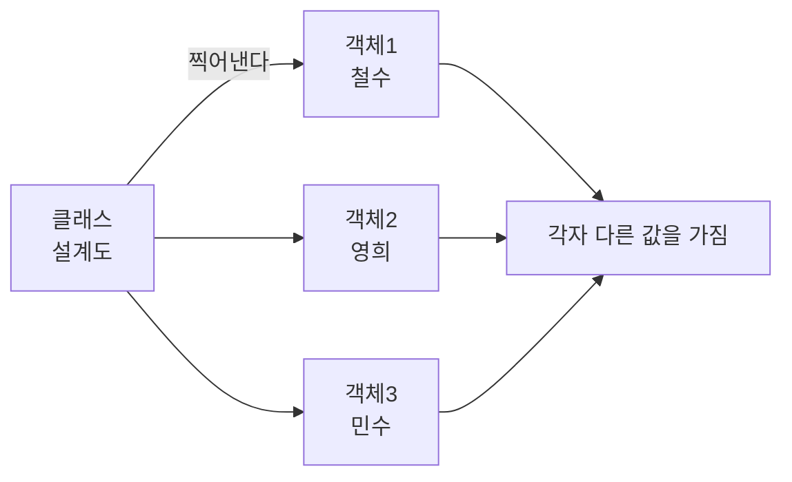
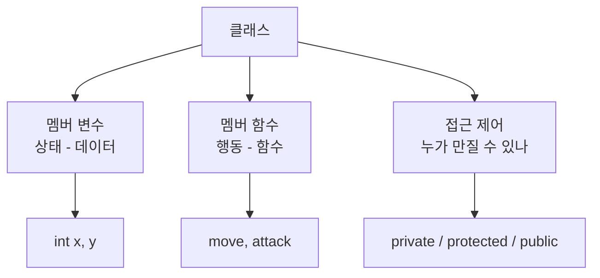
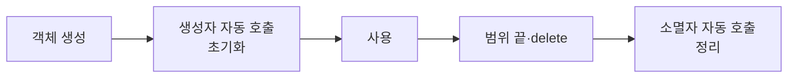
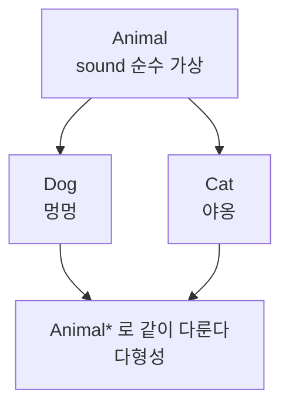

# 클래스 - 설계도로 찍어내는 객체

## 왜 클래스인가?

같은 모양의 데이터를 여러 개 만들어야 할 때가 있다. 학생 100명이면 이름·점수·학번이 100세트다.
클래스는 **"이렇게 생긴 것을 찍어내자"는 설계도**다.

> 비유: 붕어빵 틀(클래스)에서 붕어빵(객체)을 찍어낸다. 틀은 하나, 붕어빵은 여러 개다.



---

## 1. 클래스 vs 구조체

둘 다 설계도다. 차이는 **기본 공개 범위**와 **기능**이다.

| 구분 | struct | class |
|---|---|---|
| 기본 공개 | public (열림) | private (잠김) |
| 상속 | 제한 | 가능 |
| 생성자·소멸자 | 없음 | 있음 |

```cpp
struct Point { int x, y; }; // x,y 바로 접근 가능

class Point2 {
private: int x, y; // 잠김 - 바깥에서 직접 못 만짐
public:
    void set(int a, int b) { x = a; y = b; }
    int getX() const { return x; }
};
```

> KOI에서는 `struct`로 좌표·간선처럼 단순 묶음을, `class`로 상태와 행동이 있는 객체를 만든다.

---

## 2. 클래스의 3요소



### 멤버 변수 - 각 객체가 따로 가지는 값

```cpp
class Rectangle {
    int width, height; // 각 사각형마다 다른 값
public:
    Rectangle(int w, int h) : width(w), height(h) {}
    int area() const { return width * height; }
};
```

### 멤버 함수 - 객체가 하는 일

```cpp
class Circle {
    double radius;
public:
    Circle(double r) : radius(r) {}
    double area() const { return 3.14159 * radius * radius; }
    void setRadius(double r) { radius = r; }
};
```

`const` 함수는 값을 바꾸지 않는다는 약속이다.

---

## 3. 생성자와 소멸자 - 만들고 없앨 때 자동 실행



```cpp
class Person {
    string name; int age;
public:
    Person() : name("Unknown"), age(0) {} // 기본 생성자
    Person(string n, int a) : name(n), age(a) {} // 오버로딩
    ~Person() { /* 필요하면 정리 */ }
};

Person p1;              // 기본 생성자
Person p2("철수", 15);  // 인자 있는 생성자
```

> 생성자가 여러 개면 **오버로딩**. 인자 개수·타입이 다르면 구분된다.

---

## 4. 접근 제어 - 누가 볼 수 있나

| 키워드 | 볼 수 있는 곳 |
|---|---|
| private | 클래스 안만 |
| protected | 클래스 안 + 자식 클래스 |
| public | 어디서나 |

```cpp
class Base {
protected: int p; // 자식이 볼 수 있음
public:    void set(int x) { p = x; }
};
class Child : public Base {
public: void f() { p = 10; } // protected라 접근 가능
};
```

---

## 5. 상속 - 기존 설계도를 확장

부모의 기능을 물려받아 자식이 더한다.

```cpp
class Animal {
public:
    virtual void sound() = 0; // 순수 가상 - 자식이 반드시 구현
    virtual ~Animal() = default;
};
class Dog : public Animal {
public:
    void sound() override { cout << "멍멍\n"; }
};
void makeSound(Animal &a) { a.sound(); } // Dog, Cat 모두 가능 - 다형성
```



> KOI에서는 깊은 상속보다 `struct` 조합을 더 많이 쓴다. 다형성은 게임·시뮬레이션 문제에서만 가끔 나온다.

---

## 6. 꼭 알아야 할 것 4가지

### 정적 멤버 - 모든 객체가 공유

```cpp
class Counter {
    static int cnt; // 모든 Counter가 같은 cnt를 봄
public:
    static void inc() { cnt++; }
};
int Counter::cnt = 0;
```

> 인스턴스 없이 `Counter::inc()`로 호출한다.

### 연산자 오버로딩 - `+`를 내 맘대로 정의

```cpp
struct Vec {
    int x, y;
    Vec operator+(const Vec& o) const { return {x+o.x, y+o.y}; }
};
Vec a{1,2}, b{3,4}, c = a + b; // (4,6)
```

### const 객체와 const 함수

`const` 객체는 `const` 함수만 부를 수 있다.

```cpp
struct Point {
    int x, y;
    int getX() const { return x; } // const 객체도 호출 가능
    void setX(int v) { x = v; }    // const 객체는 호출 불가
};
```

### 템플릿 클래스 - 타입을 나중에 정한다

```cpp
template<typename T>
struct Box {
    T value;
    Box(T v) : value(v) {}
};
Box<int> bi(10);
Box<string> bs("hello");
```

> `vector<int>`, `map<string,int>`가 바로 템플릿 클래스다.

---

## 7. KOI에서 클래스를 쓰는 경우

KOI는 알고리즘 대회라 클래스를 깊게 묻지 않는다. 다음 정도만 쓴다:

```cpp
// 1. 좌표·간선 묶기 - struct가 가장 간단
struct Node { int x, y, dist; };

// 2. 정렬 기준 - 연산자 오버로딩
struct Act { int s, e; bool operator<(Act const& o) const { return e < o.e; } };

// 3. DSU·그래프처럼 상태+함수가 필요한 것 - class
class DSU {
    vector<int> p, r;
public:
    DSU(int n): p(n), r(n,0) { iota(p.begin(), p.end(), 0); }
    int find(int x) { return p[x]==x ? x : p[x]=find(p[x]); }
    void unite(int a,int b) { /* ... */ }
};
```

> KOI 중등부에서는 상속·가상 함수까지 갈 일은 거의 없다. `struct` + 생성자 + `operator<` 3개면 충분하다.

---

## 8. 자주 하는 실수

| 실수 | 결과 |
|---|---|
| 멤버를 `public`으로 다 열어둠 | 바깥에서 잘못 바꿔 버그가 숨어든다 |
| `new`로 만든 것을 `delete` 안 함 | 메모리 누수 |
| `const` 함수를 `const`로 안 적음 | `const` 객체에서 호출 불가 에러 |

---

## 9. 직접 손으로 풀어 보기

**문제 1.** `class A { int x; public: void set(int v){x=v;} };` 에서 `A a; a.x=5;`는?

<details><summary>풀이</summary>
컴파일 에러. `x`는 private라 바깥에서 직접 못 만진다. `a.set(5)`로 해야 한다.
</details>

**문제 2.** `struct Vec{int x,y;}; Vec a{1,2}, b{3,4};`에서 `a+b`를 하려면?

<details><summary>풀이</summary>
`operator+`를 정의해야 한다. 없으면 `+`가 무슨 뜻인지 컴파일러가 모른다.
</details>
