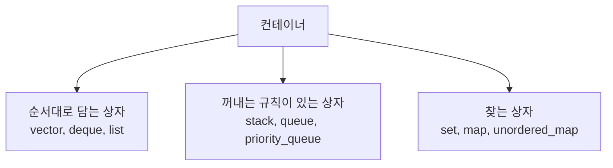
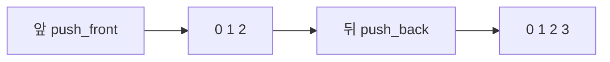
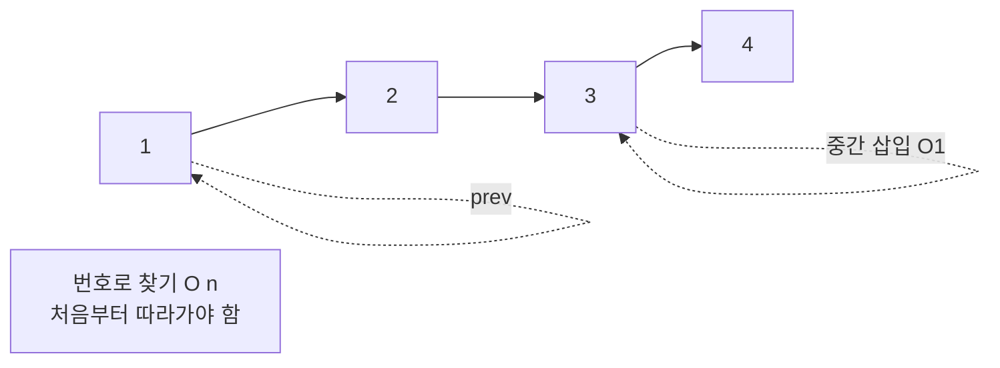
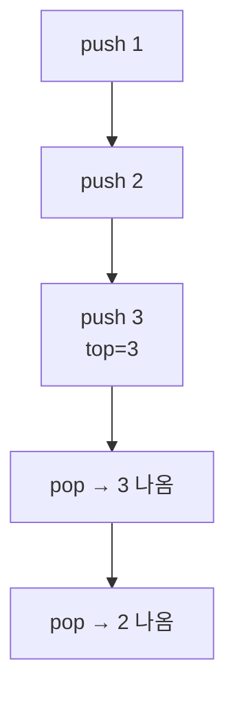
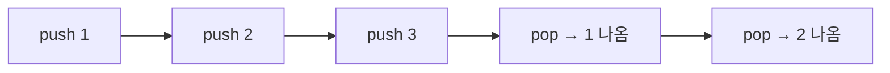
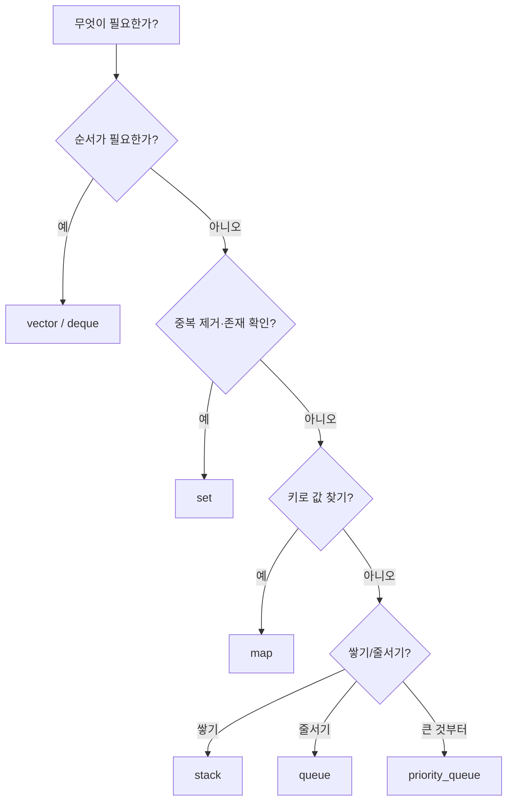

# C++ 컨테이너 - 데이터를 담는 상자

## 컨테이너란?

데이터를 담는 상자다. 상자마다 꺼내는 방법과 속도가 다르다.
KOI는 "어떤 상자를 쓰면 가장 빠른지"를 묻는 대회다.



---

## 1. Vector - 가장 기본 상자 (동적 배열)

연속된 칸에 차례로 담는다. 번호로 바로 꺼낼 수 있다.

```mermaid
flowchart LR
    V1[0:1] --- V2[1:3] --- V3[2:5] --- V4[3:7] --- V5[4:9]
    V6[vec[2] → 5 O1\n바로 꺼냄]
```

| 연산 | 시간 | 설명 |
|---|---|---|
| `push_back(x)` | 평균 O(1) | 뒤에 추가 |
| `pop_back()` | O(1) | 뒤에서 빼기 |
| `a[i]` / `at(i)` | O(1) | 번호로 접근 |
| `insert(pos,x)` | O(n) | 중간에 끼우면 뒤가 다 밀림 |
| `erase(pos)` | O(n) | 중간에서 빼면 뒤가 다 당겨짐 |

```cpp
#include <bits/stdc++.h>
using namespace std;
int main() {
    vector<int> a = {1, 3, 5, 7, 9};
    a.push_back(11);              // 1 3 5 7 9 11
    a.insert(a.begin() + 2, 4);   // 1 3 4 5 7 9 11 (중간 삽입)
    a.erase(a.begin() + 1);       // 1 4 5 7 9 11
    sort(a.begin(), a.end());
    for (int x : a) cout << x << ' ';
}
```

> KOI 기본값: 특별한 이유가 없으면 `vector`를 쓴다.

---

## 2. Deque - 양쪽으로 넣고 빼는 상자

앞뒤 모두에서 O(1)로 넣고 뺀다. `vector`는 앞에서 넣기가 느리다.



```cpp
deque<int> dq;
dq.push_back(1);   // 1
dq.push_front(0);  // 0 1
dq.push_back(2);   // 0 1 2
dq.pop_front();    // 1 2
```

> BFS 큐, 슬라이딩 윈도우에서 `deque`가 주역이다.

---

## 3. List - 줄줄이 연결된 상자

칸이 떨어져 있고 화살표로 연결된다. 중간에 끼우기·빼기는 빠르지만 번호로 바로 가기는 느리다.



| 연산 | 시간 |
|---|---|
| `push_front/back` | O(1) |
| `insert(pos,x)` | O(1) (위치만 알면) |
| `erase(pos)` | O(1) |
| `a[i]` | 불가 (없음) |

> KOI에서 `list`는 거의 안 쓴다. `vector`가 캐시 때문에 실제로 더 빠르다. 중간 삽입이 정말 많을 때만 고려한다.

---

## 4. Stack - 쌓는 상자 (LIFO)

마지막에 넣은 것이 먼저 나온다. 접시 쌓기와 같다.



```cpp
stack<int> st;
st.push(1); st.push(2); st.push(3);
cout << st.top() << '\n'; // 3
st.pop(); // 3 제거
```

> 괄호 짝 맞추기, DFS에서 쓴다.

---

## 5. Queue - 줄 서는 상자 (FIFO)

먼저 온 사람이 먼저 나간다. 매표소 줄과 같다.



```cpp
queue<int> q;
q.push(1); q.push(2); q.push(3);
cout << q.front() << '\n'; // 1
q.pop();
```

> BFS에서 쓴다.

---

## 6. Priority Queue - 줄을 새치기하는 상자

"가장 큰(또는 작은) 것"이 먼저 나온다. 힙으로 만들어진다.

```cpp
priority_queue<int> pq; // 큰 것부터
pq.push(10); pq.push(5); pq.push(15);
cout << pq.top() << '\n'; // 15
pq.pop();

// 작은 것부터
priority_queue<int, vector<int>, greater<int>> minpq;
```

> 다익스트라, "가장 큰 k개" 문제에서 쓴다.

---

## 7. Set / Map / Unordered

집합과 맵은 `Set_n_Map.md`에서 자세히 다뤘다. 여기서는 한눈에 비교만 한다.

| 컨테이너 | 정렬 | 중복 | 평균 탐색 |
|---|---|---|---|
| `set` | 함 | 없음 | O(log n) |
| `map` | 키 정렬 | 키 중복 없음 | O(log n) |
| `unordered_set/map` | 안 함 | 없음 / 키 중복 없음 | O(1) |



---

## 8. 선택 기준 - KOI 10초 컷

| 상황 | 답 |
|---|---|
| 그냥 담고 순서대로 본다 | `vector` |
| 앞에서 넣고 빼기가 많다 | `deque` |
| 괄호·되돌리기 | `stack` |
| BFS·줄서기 | `queue` |
| 가장 큰 것부터 꺼내기 | `priority_queue` |
| 중복 제거·정렬 유지 | `set` |
| 키로 값 찾기 + 정렬 | `map` |
| 키로 값 찾기 + 속도 최우선 | `unordered_map` |

> 실수 1순위: `vector` 중간에 `insert`를 반복하면 O(n²)가 된다. 앞에서 자주 넣어야 하면 처음부터 `deque`를 쓴다.
> 실수 2순위: `at(i)`와 `[i]` 차이. `at`은 범위 밖이면 에러를 알려 주고, `[i]`는 그냥 넘어가 틀린 값이 나온다. 연습할 때는 `at`을 쓰자.

---

## 9. 직접 손으로 풀어 보기

**문제 1.** `vector {1,2,3}`에서 `insert(begin()+1, 9)` 결과는?

<details><summary>풀이</summary>
1 9 2 3. 1 뒤에 9가 끼고 나머지가 뒤로 밀린다.
</details>

**문제 2.** BFS를 구현할 때 `stack`과 `queue` 중 무엇인가?

<details><summary>풀이</summary>
`queue`. BFS는 먼저 들어온 것을 먼저 꺼내야 가까운 것부터 퍼진다. `stack`은 DFS가 된다.
</details>
