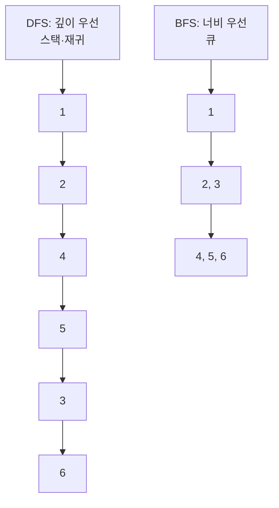
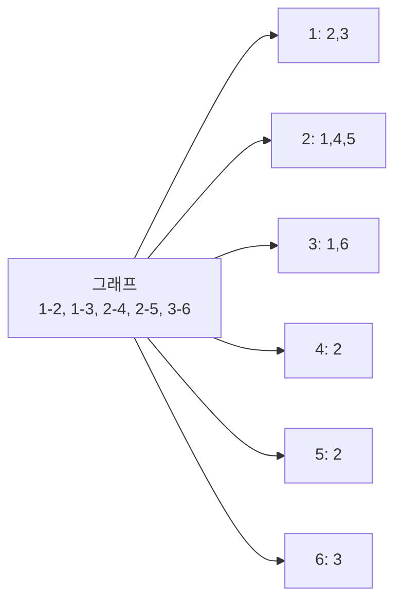
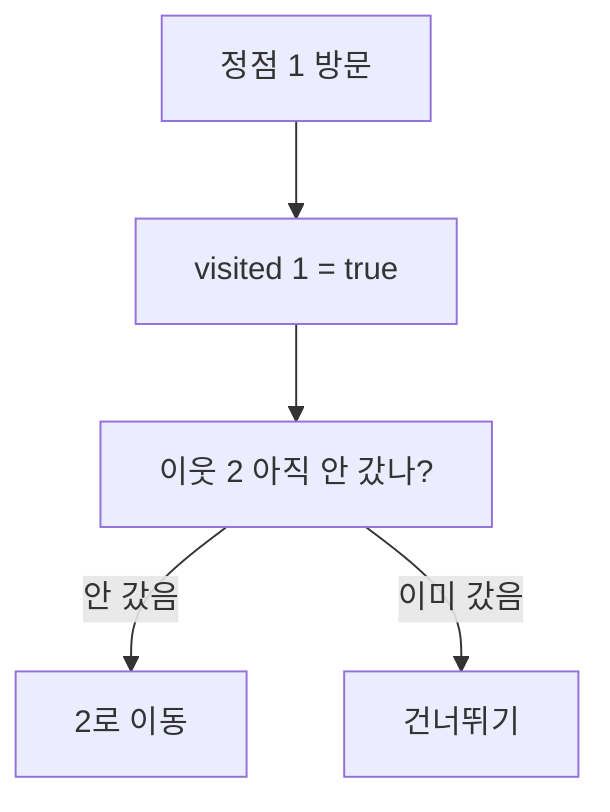
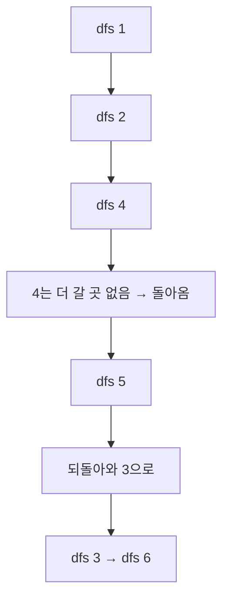
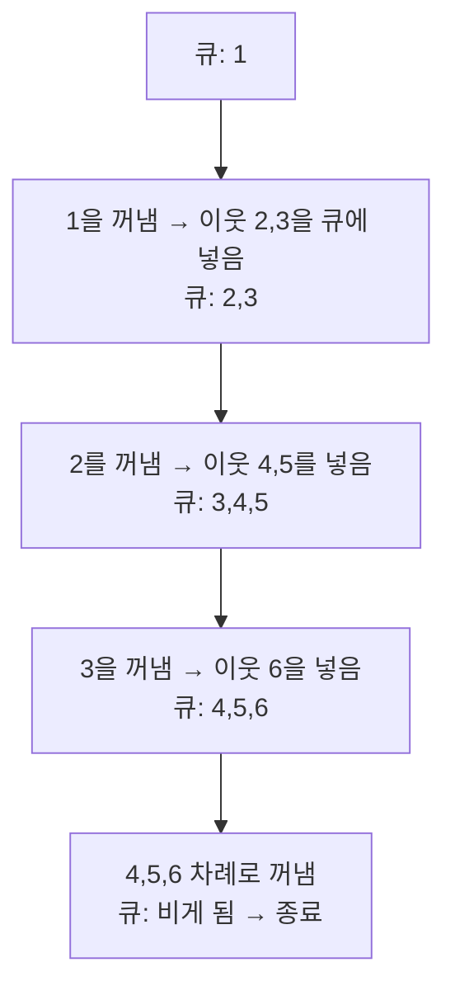
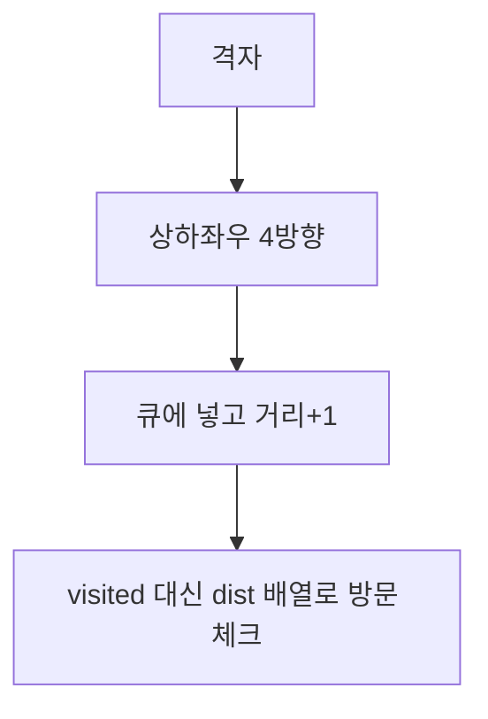

# DFS와 BFS - 그래프 탐색의 두 가지 길

## 왜 배워야 할까?

지도, 미로, 친구 관계, 게임 맵은 모두 그래프다.
DFS와 BFS는 그래프를 빠짐없이 훑는 가장 기본 도구다.
KOI 그래프 문제의 80%는 이 둘 중 하나로 시작한다.

> 비유: 미로 탐색
> - DFS: 한 길을 끝까지 간다. 막히면 돌아와 다른 길로 간다. (깊이 우선)
> - BFS: 시작점에서 가까운 곳부터 동그랗게 퍼져 나간다. (너비 우선)

---

## 1. 그림으로 보는 차이

그래프:
```
    1
   / \
  2   3
 / \   \
4   5   6
```



- DFS 순서: 1 → 2 → 4 → 5 → 3 → 6 (한쪽을 끝까지)
- BFS 순서: 1 → 2 → 3 → 4 → 5 → 6 (가까운 것부터)

| 구분 | DFS | BFS |
|---|---|---|
| 쓰는 도구 | 스택 (재귀 호출) | 큐 |
| 메모리 | 적게 쓴다 | 레벨을 다 저장해 많이 쓴다 |
| 최단 거리 | 보장 안 됨 | 간선 수가 같은 그래프에서는 최단 거리 보장 |
| 쓰임 | 연결 요소, 경로 존재, 사이클 찾기 | 최단 거리, 퍼져 나가기 |

---

## 2. 준비물: 그래프와 방문 표시

### 인접 리스트로 그래프 만들기

정점마다 "연결된 정점 목록"을 가진다.



```cpp
int n = 6;
vector<vector<int>> graph(n + 1);
graph[1] = {2, 3};
graph[2] = {1, 4, 5};
graph[3] = {1, 6};
```

### 방문 배열 `visited`

한 번 간 곳을 또 가면 무한 반복에 빠진다. 방문 표시가 필수다.



---

## 3. DFS - 재귀 한 번으로 끝

한 정점에 들어가면, 이웃을 하나씩 재귀로 더 깊이 들어간다.



```cpp
#include <bits/stdc++.h>
using namespace std;

vector<vector<int>> graph;
vector<bool> visited;

void dfs(int cur) {
    visited[cur] = true;
    cout << cur << ' '; // 방문 순서 출력

    for (int nxt : graph[cur]) {
        if (!visited[nxt]) {
            dfs(nxt); // 더 깊이 들어간다
        }
    }
}

int main() {
    int n = 6;
    graph.assign(n + 1, {});
    graph[1] = {2, 3};
    graph[2] = {1, 4, 5};
    graph[3] = {1, 6};
    graph[4] = {2};
    graph[5] = {2};
    graph[6] = {3};

    visited.assign(n + 1, false);
    dfs(1); // 1 2 4 5 3 6
}
```

> 주의: 재귀가 너무 깊어지면(예: 10만 단계) 스택이 넘칠 수 있다. 그때는 반복문+스택으로 바꾼다.

---

## 4. BFS - 큐로 퍼져 나가기

시작점을 큐에 넣고, 앞에서 꺼내면서 이웃을 뒤에 줄 세운다.



```cpp
#include <bits/stdc++.h>
using namespace std;

void bfs(int start, vector<vector<int>>& graph) {
    int n = graph.size() - 1;
    vector<bool> visited(n + 1, false);
    queue<int> q;

    q.push(start);
    visited[start] = true;

    while (!q.empty()) {
        int cur = q.front(); q.pop();
        cout << cur << ' ';

        for (int nxt : graph[cur]) {
            if (!visited[nxt]) {
                visited[nxt] = true;
                q.push(nxt); // 다음에 방문할 곳을 줄 세우기
            }
        }
    }
}
```

BFS는 **시작점에서 간선 수 기준 최단 거리**가 된다. 그래서 미로 최단 거리 문제는 BFS로 푼다.

---

## 5. 격자(2차원)에서의 DFS/BFS

KOI 단골: N×M 지도에서 0은 빈 칸, 1은 벽. (0,0)에서 (N-1,M-1)까지 최단 거리

```cpp
int n, m;
vector<string> board;
int dist[1005][1005]; // 거리 저장
int dx[4] = {-1, 1, 0, 0};
int dy[4] = {0, 0, -1, 1};

int bfs_grid() {
    queue<pair<int,int>> q;
    q.push({0, 0});
    dist[0][0] = 1;

    while (!q.empty()) {
        auto [x, y] = q.front(); q.pop();
        for (int dir = 0; dir < 4; dir++) {
            int nx = x + dx[dir], ny = y + dy[dir];
            if (nx < 0 || nx >= n || ny < 0 || ny >= m) continue; // 밖으로 나감
            if (board[nx][ny] == '1') continue; // 벽
            if (dist[nx][ny] != 0) continue;    // 이미 방문
            dist[nx][ny] = dist[x][y] + 1;
            q.push({nx, ny});
        }
    }
    return dist[n-1][m-1];
}
```



---

## 6. 직접 손으로 풀어 보기

**문제 1.** 위 그래프에서 DFS를 1에서 시작하되 이웃을 오름차순으로 방문한다. 순서는?

<details><summary>풀이</summary>
1 → 2 → 4 → 5 → 3 → 6
</details>

**문제 2.** 간선 가중치가 모두 1일 때, 1에서 6까지 최단 거리는 DFS와 BFS 중 무엇으로 구하나?

<details><summary>풀이</summary>
BFS. BFS는 가까운 것부터 퍼지므로 처음 6에 도달했을 때가 최단 거리다. DFS는 깊이 우선이라 최단이 아닐 수 있다.
</details>

---

## 7. KOI에서는 이렇게 나온다

- "연결된 덩어리 개수" → DFS로 한 덩어리씩 칠하기
- "미로 최단 거리" → BFS
- "사이클이 있는가?" → DFS와 방문 상태 3가지(미방문/방문중/완료)로 판별
- 격자 문제는 DFS/BFS 중 무엇이든 될 수 있으니 둘 다 손에 익혀 둔다.
