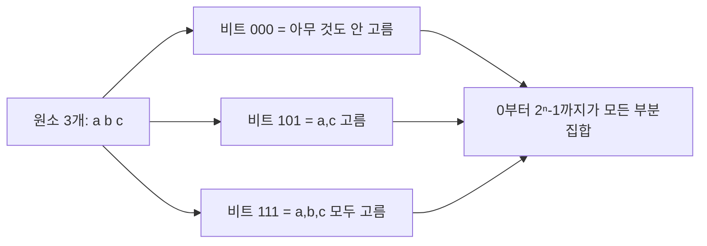
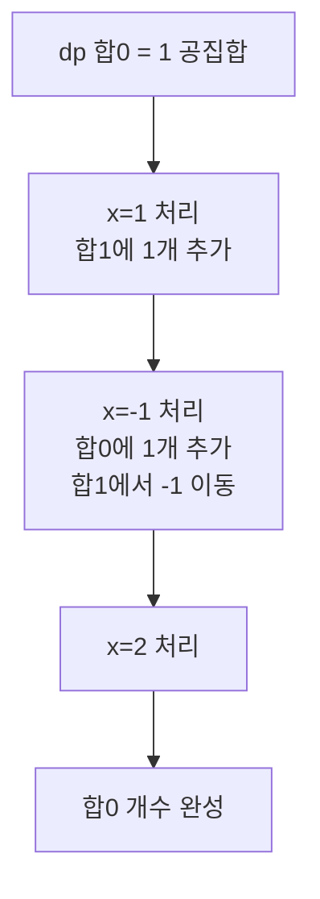
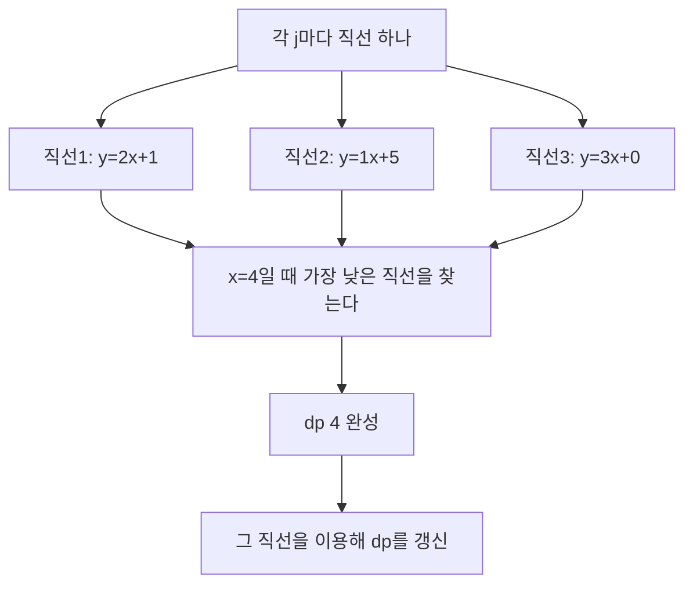
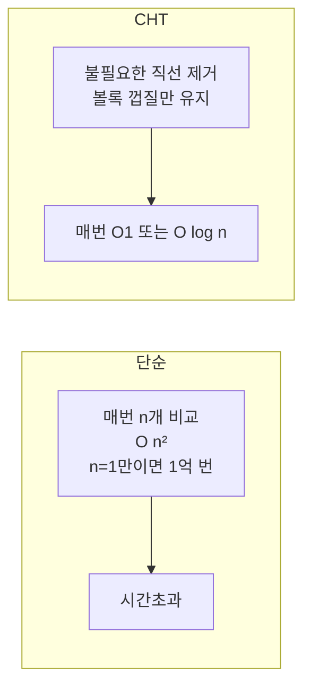
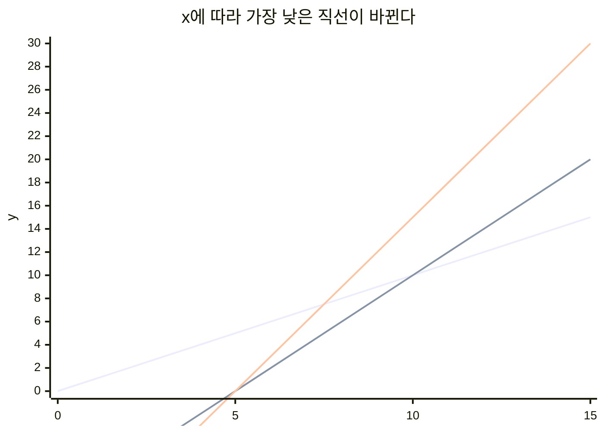
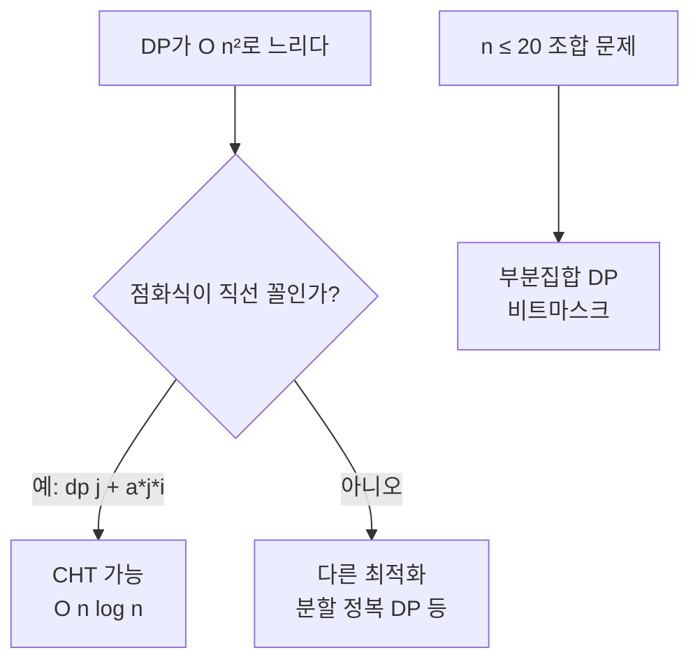

# DP 고급 2 - 부분집합 DP와 볼록 껍질 최적화

> 이 장은 KOI 고등부·대학부에서 나오는 고급 기법이다. 중등부는 개념만 이해하고, "이런 게 있다"를 알면 된다. 바로 구현하려 하지 말고 그림으로 흐름을 익히자.

---

## 1. 부분집합 DP - 비트로 부분집합을 표현한다

n개 중 몇 개를 고르는 경우의 수는 2ⁿ. 각 원소를 "넣는다/안 넣는다" 2가지로 표현한다.



| 비트 | 고른 원소 | 합 |
|---|---|---|
| 000 | 없음 | 0 |
| 001 | c | 3 |
| 010 | b | 2 |
| 011 | b,c | 5 |
| 100 | a | 1 |
| ... | ... | ... |
| 111 | a,b,c | 6 |

> `mask = 5`는 이진수로 `101` → 0번과 2번 원소를 고른 것이다.

---

### 예제: 합이 0이 되는 부분집합 수 세기

배열 `[1, -1, 2]`에서 합이 0이 되는 부분집합은? → `{}`, `{1,-1}`, `{1,-1,?}` 조합을 다 세면 된다.

**아이디어**: `dp[합] = 그 합을 만드는 부분집합 수`

```cpp
#include <bits/stdc++.h>
using namespace std;

int main() {
    vector<int> a = {1, -1, 2};
    int n = a.size();
    int offset = 10; // 음수 합을 배열에 담기 위한 이동
    int maxSum = 20;
    vector<int> dp(2*maxSum+1, 0), ndp = dp;
    dp[offset] = 1; // 합 0인 공집합 1개

    for (int x : a) {
        ndp = dp;
        for (int s = 0; s <= 2*maxSum; s++) if (dp[s]) {
            int ns = s + x;
            if (0 <= ns && ns <= 2*maxSum) ndp[ns] += dp[s];
        }
        dp = ndp;
    }
    cout << dp[offset] << '\n'; // 합 0인 경우 수 (공집합 제외하려면 -1)
}
```



### 언제 쓰고, 언제 안 쓰나

| 구분 | 설명 |
|---|---|
| 적합 | n ≤ 20, 2ⁿ을 다 볼 수 있을 때 |
| 부적합 | n > 25 → 3,300만 이상, 메모리·시간 초과 |
| 대안 | 합이 작으면 합 기준 DP, 크면 다른 방법 |

> 중등부에서는 n=20 이하 부분집합 문제는 `for(mask=0; mask < (1<<n); mask++)`로 직접 다 보는 것이 더 직관적이다. 위 `dp[합]` 방법은 합이 작을 때 쓰는 최적화다.

```cpp
// 더 직관적인 방법 (n ≤ 20)
int n = 5;
vector<int> a = {1,2,3,4,5};
int cnt = 0;
for (int mask = 0; mask < (1 << n); mask++) {
    int sum = 0;
    for (int i = 0; i < n; i++) if (mask & (1<<i)) sum += a[i];
    if (sum == 10) cnt++;
}
cout << cnt << '\n';
```

---

## 2. CHT - 직선 중 가장 낮은 것을 빠르게 찾기

> 이름은 어렵지만 아이디어는 단순하다. "직선이 여러 개 있을 때, x마다 가장 낮은 직선을 빨리 찾자"다.

DP 점화식이 이런 꼴일 때 등장한다:

```
dp[i] = min(j<i) { dp[j] + a*j * i + b*j }
       = min(j<i) { (a*j)*i + (dp[j]+b*j) }
       = min(j<i) { 기울기*i + 절편 }
```

→ 각 j마다 직선 `y = 기울기 * x + 절편` 하나가 생긴다. x=i일 때 가장 낮은 y가 dp[i]다.



### 왜 필요한가?

직선이 n개면, 매번 n개를 다 비교하면 O(n²). 10만 개면 100억 번.
CHT는 정렬된 직선에서 볼록 껍질만 남겨 O(n) 또는 O(n log n)에 찾는다.



### 직관만 잡기 (구현은 고급 과정)

```
직선 A: y = 1x + 0
직선 B: y = 2x - 10
직선 C: y = 3x - 15

x가 작을 때는 A가 가장 낮고,
x가 커지면 B가, 더 커지면 C가 가장 낮다.
→ 교점 순서대로 껍질에 담아 두면, x가 커질 때 차례로 꺼내 쓰면 된다.
```



> 중학생은 여기까지만 이해하면 된다: "직선 여러 개 중 최소값을 매번 빠르게 찾는 기술이 CHT다. DP가 O(n²)로 너무 느릴 때 쓴다."

---

## 3. 정리

| 기법 | 한 줄 정의 | n 제한 | KOI 등장 |
|---|---|---|---|
| 부분집합 DP | 비트로 부분집합을 표현해 DP | n ≤ 20 | 조합·부분집합 세기 |
| CHT | 직선 중 최소값을 빠르게 찾기 | n ≤ 200,000 | DP 최적화 |



---

## 4. 직접 손으로 풀어 보기

**문제 1.** n=4, 배열 `[1,2,3,4]`에서 부분집합은 몇 개인가? 짝수 개 원소를 포함하는 부분집합은 몇 개인가?

<details><summary>풀이</summary>
전체 2⁴=16개. 짝수 개(0,2,4개) 포함은 8개. (홀수 개도 8개로 절반씩이다. 2ⁿ⁻¹)
</details>

**문제 2.** `dp[i] = min(dp[j] + (i-j)*2 + 5)` 형태에서 CHT를 쓸 수 있는 이유는?

<details><summary>풀이</summary>
`(i-j)*2+5 = 2*i + (-2*j+5)` → `2*i`는 i에만, `-2*j+5+dp[j]`는 j에만 의존. 즉 `기울기*i + 절편` 꼴의 직선이 되므로 CHT 대상이다.
</details>

---

## 5. KOI에서는 이렇게 나온다

- 부분집합 DP는 중등부에서는 `mask` 완전 탐색으로, 고등부에서는 합 DP로 변형돼 나온다.
- CHT는 고등부 이상에서 `dp[i] = min(dp[j] + a*j*i + b)` 형태를 보면 의심한다. 중등부는 "이런 최적화가 있다"만 알고 넘어가도 된다.
- 두 기법 모두 **점화식을 직선/비트 꼴로 다시 쓰는 눈**이 핵심이다.
