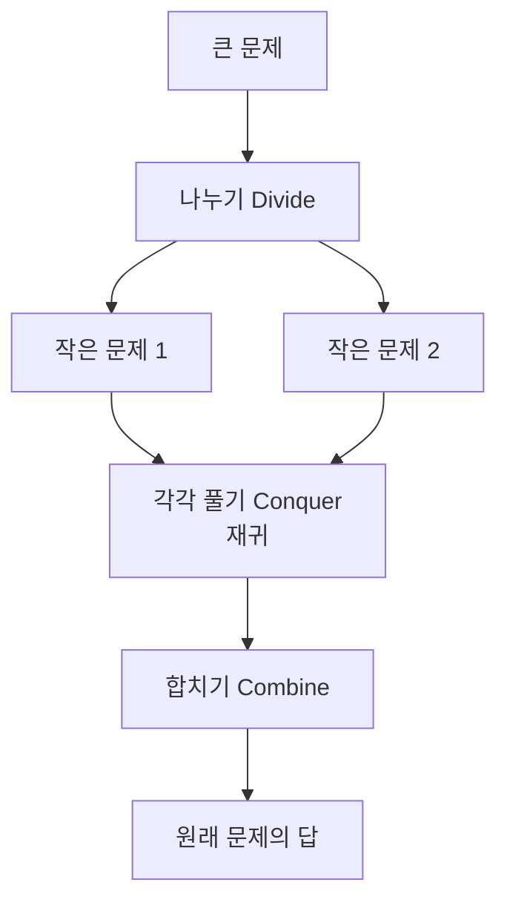
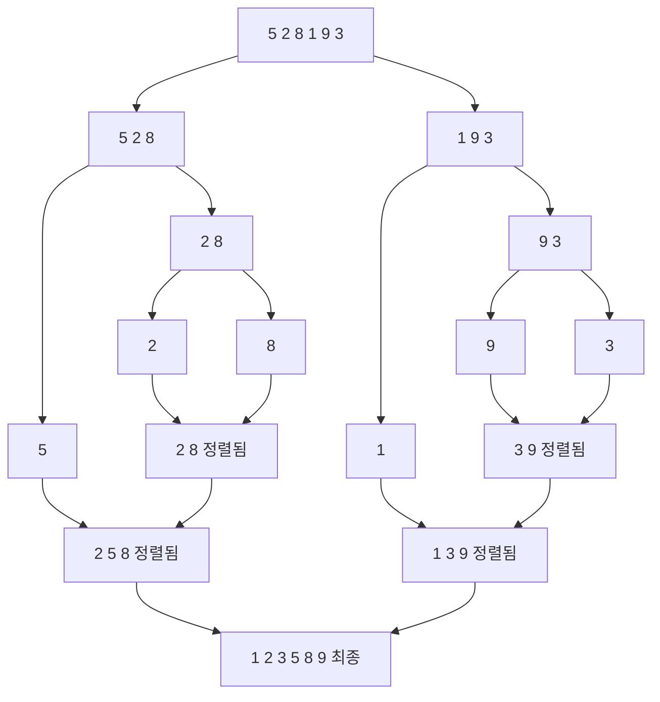
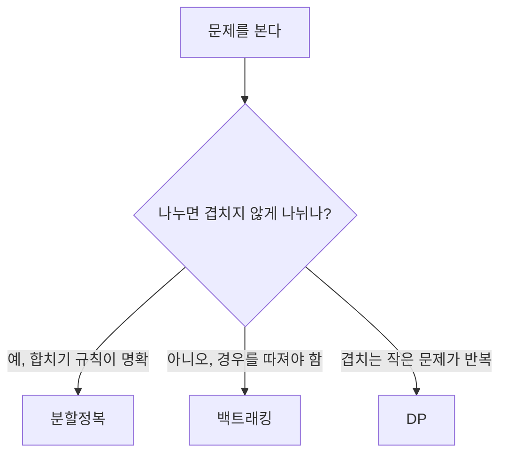
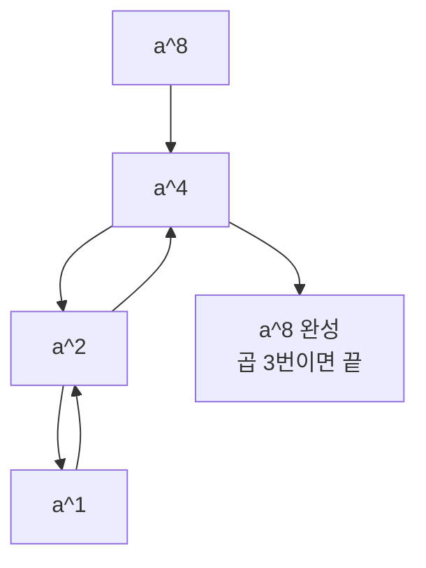

# 분할정복 - 나누고, 풀고, 합친다

## 정의

큰 문제를 **작은 문제로 나누고**(Divide), **각각 풀고**(Conquer), **합쳐서**(Combine) 원래 문제를 푼다.

> 비유: 1,000쪽 사전을 가나다 순으로 정렬하기. 한 명이 1,000쪽을 다 정리하면 오래 걸린다. 500쪽씩 나눠 두 명이 정렬한 뒤 합치면 훨씬 빠르다.

3단계가 항상 순서대로 간다.



종료 조건(더 이상 못 나누는 작은 문제)이 없으면 무한 반복에 빠진다.

---

## 1. 대표 예제: 병합 정렬

배열을 반으로 나누고, 각각 정렬한 뒤, 두 정렬된 배열을 합친다.



```cpp
#include <bits/stdc++.h>
using namespace std;

void merge(vector<int>& a, int l, int m, int r) {
    vector<int> left(a.begin() + l, a.begin() + m + 1);
    vector<int> right(a.begin() + m + 1, a.begin() + r + 1);
    int i = 0, j = 0, k = l;
    while (i < left.size() && j < right.size()) {
        if (left[i] <= right[j]) a[k++] = left[i++];
        else                     a[k++] = right[j++];
    }
    while (i < left.size()) a[k++] = left[i++];
    while (j < right.size()) a[k++] = right[j++];
}

void mergeSort(vector<int>& a, int l, int r) {
    if (l >= r) return; // 더 못 나누면 종료
    int m = (l + r) / 2;
    mergeSort(a, l, m);     // 왼쪽 절반 정렬
    mergeSort(a, m + 1, r); // 오른쪽 절반 정렬
    merge(a, l, m, r);      // 합치기
}

int main() {
    vector<int> a = {5, 2, 8, 1, 9, 3};
    mergeSort(a, 0, a.size() - 1);
    for (int x : a) cout << x << ' '; // 1 2 3 5 8 9
}
```

시간: O(n log n), 공간: O(n) (합칠 때 임시 배열 필요)

---

## 2. 분할정복이 좋은 경우와 아닌 경우

| 좋은 경우 | 이유 |
|---|---|
| 정렬 | 나누고 합치면 전체가 정렬된다 |
| 거듭제곱, 이분탐색 | 반으로 줄일 때마다 문제가 절반이 된다 |

| 아닌 경우 | 이유 |
|---|---|
| 1~n 중 3개 고르기 | 나누면 중복이 생기고 합치기 규칙이 없다 → 백트래킹이 맞다 |
| 피보나치 수열을 그대로 재귀 | 같은 계산을 반복한다 → DP가 맞다 |



---

## 3. 또 다른 예: 거듭제곱 빠르게 구하기

`aⁿ`을 구할 때 n번 곱하면 O(n). 분할정복이면 O(log n).

- n이 짝수: aⁿ = (aⁿ/²)²
- n이 홀수: aⁿ = (aⁿ/²)² × a



```cpp
long long power(long long a, long long n) {
    if (n == 0) return 1;
    long long half = power(a, n / 2);
    long long res = half * half;
    if (n % 2 == 1) res *= a;
    return res;
}
```

---

## 4. 직접 손으로 풀어 보기

**문제 1.** `[6, 3, 8, 1]`을 병합 정렬로 나누는 과정을 트리로 그려라.

<details><summary>풀이</summary>
[6,3,8,1] → [6,3] [8,1] → [6][3] [8][1] → [3,6] [1,8] → [1,3,6,8]
</details>

**문제 2.** `a=2, n=10`일 때 `power`는 곱을 몇 번 하나?

<details><summary>풀이</summary>
2¹⁰ → 2⁵ → 2² → 2¹ → 1. 거슬러 올라오며 4번 곱. O(log n).
</details>

---

## 5. KOI에서는 이렇게 나온다

- "정렬하라"는 분할정복을 직접 구현하라는 뜻이 아니다. `sort()`가 분할정복(퀵·병합 계열)으로 이미 구현돼 있다.
- 분할정복은 "합치는 방법이 명확한 문제"에서만 쓴다. 합치는 법이 떠오르지 않으면 다른 방법을 고민한다.
- 재귀 깊이가 깊어지면 스택 오버플로우가 난다. n이 매우 크면 반복문으로 바꾸거나 꼬리 재귀를 고민한다.
