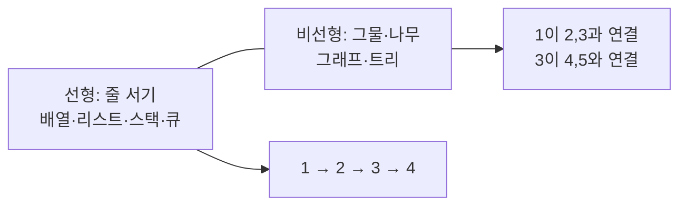
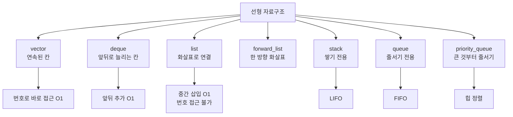
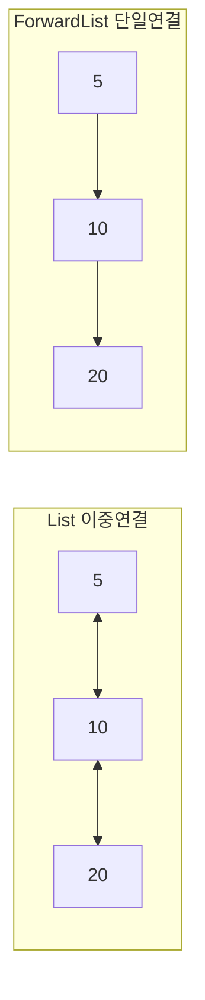
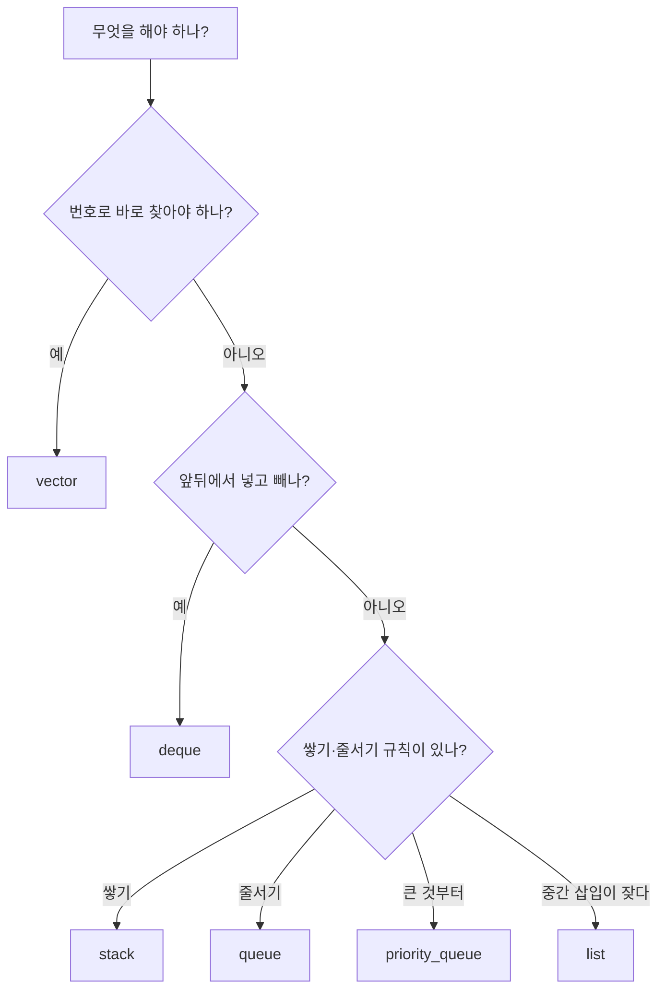

# 선형 자료구조 - 일렬로 늘어선 데이터

## 선형이란?

데이터가 **한 줄로 순서대로** 늘어선 것이다. 줄의 앞뒤만으로 위치를 정할 수 있다.



> 비유: 선형은 줄 서기, 비선형은 친구 관계 그물이다. KOI는 선형을 먼저 완벽히 한 뒤 그물로 넘어간다.

---

## 1. 선형의 특징 3가지

1. **순서**가 있다. 첫 번째, 두 번째가 정해진다.
2. **한 칸에 하나**가 들어간다 (스택·큐도 결국 선형이다).
3. **앞뒤 관계**로 탐색한다. 다음 칸, 이전 칸으로만 움직인다.

---

## 2. STL로 보는 선형 컨테이너 지도



---

## 3. 각 컨테이너 한눈에

### Vector - 번호로 바로 가는 배열

가장 많이 쓴다. 연속된 메모리에 담아 `a[2]`가 1번에 된다.

```cpp
vector<int> a = {10, 20, 30};
a.push_back(40); // 뒤에 추가 O1
cout << a[1] << '\n'; // 20
a.insert(a.begin()+1, 15); // 중간 삽입 O n - 뒤가 밀림
```

### Deque - 양쪽 문이 있는 배열

앞뒤 모두에서 넣고 뺄 수 있다.

```cpp
deque<int> dq;
dq.push_front(5); // 5
dq.push_back(10); // 5 10
dq.pop_front();   // 10
```

> BFS 큐는 `queue`보다 `deque`가 더 유연해서 `deque`로 직접 구현하기도 한다.

### List / Forward List - 화살표로 연결

연속되지 않고 노드마다 다음(그리고 이전)을 가리킨다.



- `list`: 앞뒤로 갈 수 있다. `push_front/back` O(1), 중간 삽입 O(1) (위치만 알면)
- `forward_list`: 앞으로만 간다. 메모리 더 적게 쓴다. `insert_after`로 뒤에만 삽입

> KOI에서 `list`를 쓸 일은 드물다. `vector`가 캐시 때문에 실제로 더 빠르다.

### Stack - 쌓기 (LIFO)

마지막에 넣은 것이 먼저 나온다.

```cpp
stack<int> st;
st.push(10); st.push(20);
cout << st.top() << '\n'; // 20
st.pop(); // 20 제거
```

쓰임: 괄호 검사, 되돌리기, DFS

### Queue - 줄서기 (FIFO)

먼저 온 것이 먼저 나간다.

```cpp
queue<int> q;
q.push(10); q.push(20);
cout << q.front() << '\n'; // 10
q.pop(); // 10 제거
```

쓰임: BFS, 작업 순서

### Priority Queue - 큰 것부터 나오기

가장 큰(또는 작은) 값이 항상 맨 앞에 있다.

```cpp
priority_queue<int> pq; // 큰 것부터
pq.push(10); pq.push(30); pq.push(20);
cout << pq.top() << '\n'; // 30

priority_queue<int, vector<int>, greater<int>> minpq; // 작은 것부터
```

쓰임: 다익스트라, 상위 k개

---

## 4. 시간 비교 한 장 정리

| 컨테이너 | 번호 접근 | 앞 추가 | 뒤 추가 | 중간 삽입 | 비고 |
|---|---|---|---|---|---|
| vector | O(1) | O(n) | O(1) | O(n) | 기본값 |
| deque | O(1) | O(1) | O(1) | O(n) | 양쪽 빠른 배열 |
| list | 불가 | O(1) | O(1) | O(1) | 포인터 연결 |
| forward_list | 불가 | O(1) | 불가 | O(1) | 한 방향만 |
| stack | top만 | - | push O(1) | - | LIFO |
| queue | front만 | - | push O(1) | - | FIFO |
| priority_queue | top만 | - | push O(log n) | - | 힙 |

---

## 5. KOI에서 바로 쓰는 선택법



> 90%는 `vector` + `queue` + `stack` + `priority_queue`로 끝난다. 나머지는 `deque`다.

---

## 6. 자주 하는 실수 3가지

1. **반복자 무효화**: `vector`에서 `insert/erase` 후 기존 반복자는 쓸 수 없다.
2. **`size()`와 `capacity()` 혼동**: `size()`는 담은 개수, `capacity()`는 담을 수 있는 최대 칸.
3. **`list`의 `size()`**: 예전에는 O(n)이었으나 C++11부터 O(1)이다. 그래도 번호 접근은 안 된다.

---

## 7. 직접 손으로 풀어 보기

**문제 1.** `vector {1,2,3}`에서 `push_front`가 필요하면 무엇을 쓰나?

<details><summary>풀이</summary>
`vector`는 앞에서 넣기가 O(n)으로 느리다. `deque`를 쓴다. `push_front` O(1).
</details>

**문제 2.** 괄호 문자열 `(()())`가 올바른지 검사하려면?

<details><summary>풀이</summary>
`stack`에 `(`를 push, `)`가 나오면 pop. 끝까지 했을 때 스택이 비면 올바름.
</details>

---

## 8. KOI에서는 이렇게 나온다

- 격자 BFS: `queue<pair<int,int>>`
- 괄호·되돌리기: `stack`
- "가장 큰 수부터 k개" : `priority_queue`
- 선형 자료구조를 고르는 문제는 따로 안 나온다. 대신 **틀린 상자를 고르면 시간초과**로 나온다.
