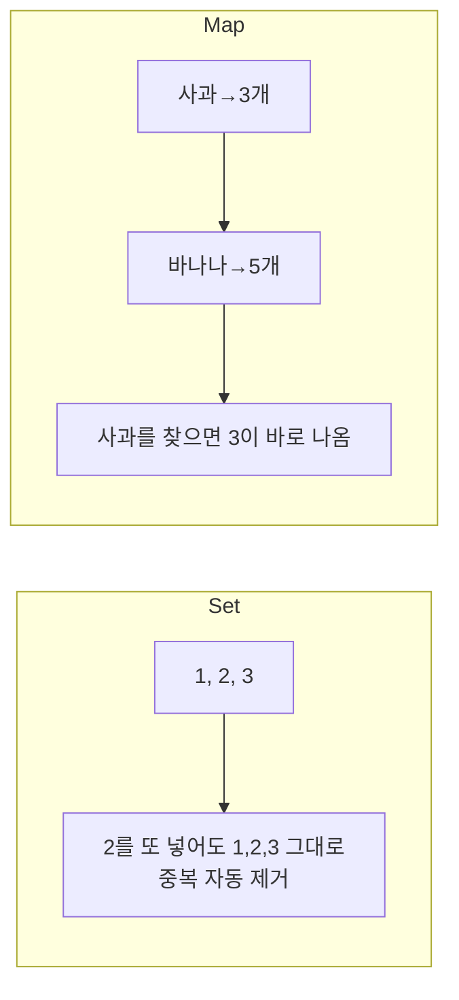
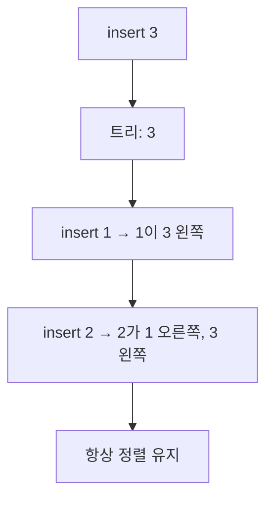
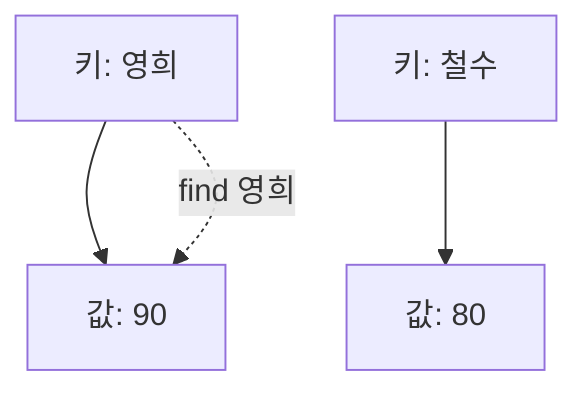
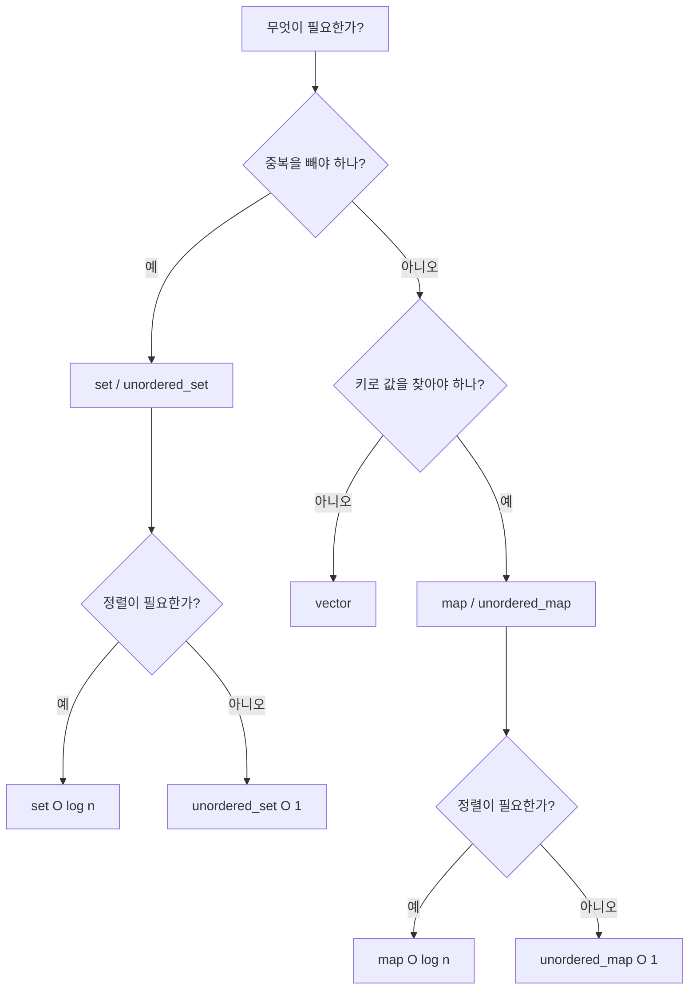

# 집합(Set)과 맵(Map) - 중복 없이, 키로 바로 찾기

## 왜 필요할까?

배열은 "몇 번째"로 찾는다. 집합과 맵은 **"값이 있는가?" "이름으로 찾기"**를 빠르게 한다.
KOI에서 "중복 제거", "등장 횟수 세기", "이름→점수"는 전부 이 둘로 푼다.

> 비유
> - 집합(Set): 출석부. 이름이 한 번만 적힌다. "영희가 있는가?"만 본다.
> - 맵(Map): 성적표. "영희 → 90점"처럼 키와 값이 짝을 이룬다.



---

## 1. 집합(Set) - 중복 없이, 정렬된 채로 보관

C++ `set`은 **정렬 + 중복 제거 + O(log n) 탐색**을 한다.

```cpp
#include <bits/stdc++.h>
using namespace std;

int main() {
    set<int> s;
    s.insert(3);
    s.insert(1);
    s.insert(2);
    s.insert(3); // 중복이라 무시됨

    for (int x : s) cout << x << ' '; // 1 2 3 (자동 정렬)
    cout << '\n';

    if (s.find(2) != s.end()) cout << "2 있음\n";
    cout << "크기: " << s.size() << '\n'; // 3
    s.erase(2);
    cout << "2 삭제 후 크기: " << s.size() << '\n'; // 2
}
```



| 연산 | 시간 | 설명 |
|---|---|---|
| `insert(x)` | O(log n) | 정렬 위치에 넣음 |
| `find(x)` | O(log n) | 있으면 위치, 없으면 end |
| `erase(x)` | O(log n) | 삭제 |
| `size()` | O(1) | 개수 |

> 더 빠른 집합이 필요하면 `unordered_set`. 평균 O(1)이지만 정렬은 안 된다.

---

## 2. 맵(Map) - 키로 값 찾기

`map<key, value>`는 **키를 정렬해 보관**한다. 키로 값을 바로 찾는다.

```cpp
#include <bits/stdc++.h>
using namespace std;

int main() {
    map<string, int> score;
    score["영희"] = 90;
    score["철수"] = 80;
    score["영희"] = 95; // 같은 키에 덮어쓰기

    if (score.find("영희") != score.end())
        cout << "영희: " << score["영희"] << '\n'; // 95

    for (auto &p : score)
        cout << p.first << " " << p.second << '\n';
    // 영희 95
    // 철수 80  (키 순 정렬)
}
```



| 연산 | 시간 | 설명 |
|---|---|---|
| `m[key] = val` | O(log n) | 넣거나 덮어쓰기 |
| `find(key)` | O(log n) | 키가 있는가 |
| `erase(key)` | O(log n) | 삭제 |

> 더 빠른 맵이 필요하면 `unordered_map`. 평균 O(1), 정렬 안 됨.

---

## 3. 언제 무엇을 쓰나



**KOI 선택 기준**

| 상황 | 추천 |
|---|---|
| 중복 제거 + 순서대로 출력 | `set` |
| 등장 횟수 세기, 빈도표 | `map` 또는 `unordered_map` |
| 빠른 존재 확인만, 순서 필요 없음 | `unordered_set` |
| 키로 빠르게 찾기, 순서 필요 없음 | `unordered_map` |

---

## 4. 예제: 등장 횟수 세기

"수 n개가 주어질 때 각 수가 몇 번 나오는가?"

```cpp
#include <bits/stdc++.h>
using namespace std;

int main() {
    vector<int> a = {1, 2, 2, 3, 3, 3};
    map<int,int> cnt;
    for (int x : a) cnt[x]++; // 없으면 0에서 1 증가

    for (auto &p : cnt)
        cout << p.first << "은 " << p.second << "번\n";
    // 1은 1번, 2는 2번, 3은 3번
}
```

```cpp
// 순서 필요 없고 더 빠르게: unordered_map
unordered_map<int,int> cnt2;
for (int x : a) cnt2[x]++;
```

---

## 5. 직접 손으로 풀어 보기

**문제 1.** `set<int> s = {5,1,3}`에 `insert(3)` `insert(4)`를 하면 s는?

<details><summary>풀이</summary>
3은 중복이라 무시, 4 추가 → {1,3,4,5} (정렬 유지)
</details>

**문제 2.** `map<string,int> m; m["a"]=1; m["b"]=2; m["a"]=3;`에서 `m["a"]`는?

<details><summary>풀이</summary>
같은 키에 덮어쓰기 → 3
</details>

---

## 6. KOI에서는 이렇게 나온다

- "서로 다른 수의 개수" → `set`에 넣고 `size()`만 보면 끝
- "각 숫자의 빈도", "가장 많이 나온 수" → `map`으로 세기
- "이름과 점수가 짝으로 주어진다" → `map<string,int>`가 정답 구조
- n이 20만 이상이고 정렬이 필요 없으면 `unordered_map`으로 바꿔 O(log n)을 O(1)로 줄인다. 시간초과가 여기서 갈린다.
