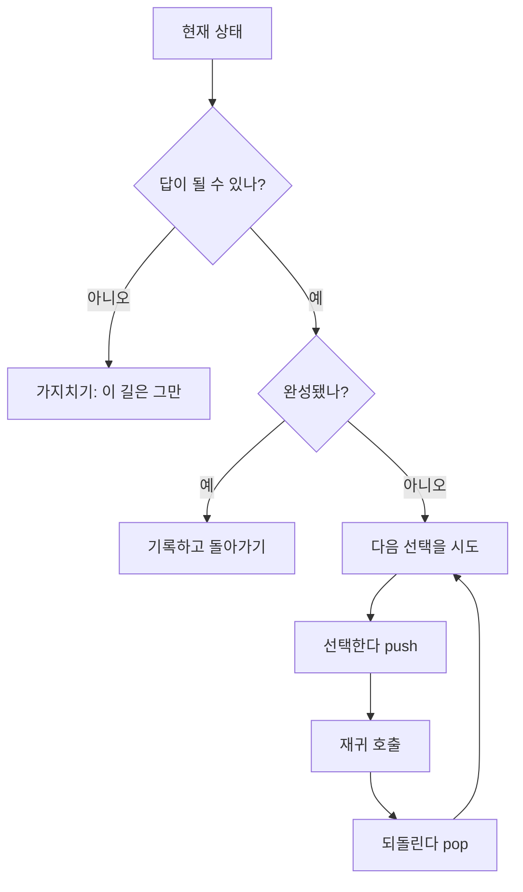
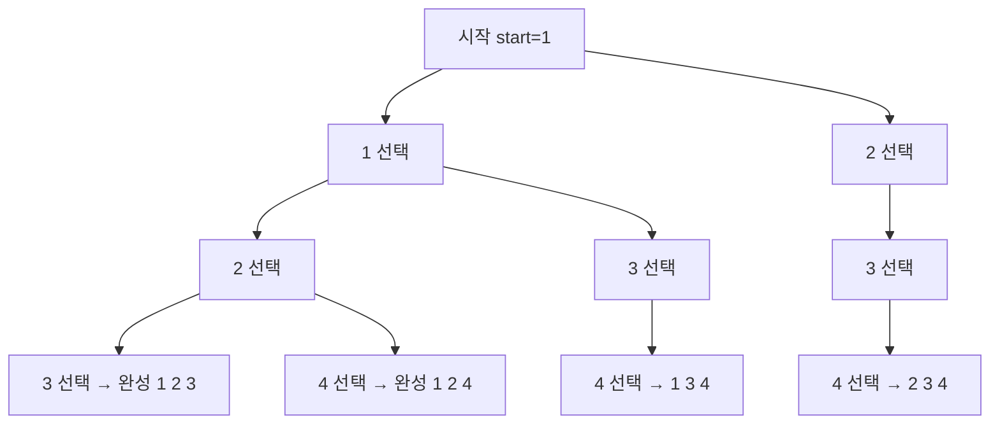
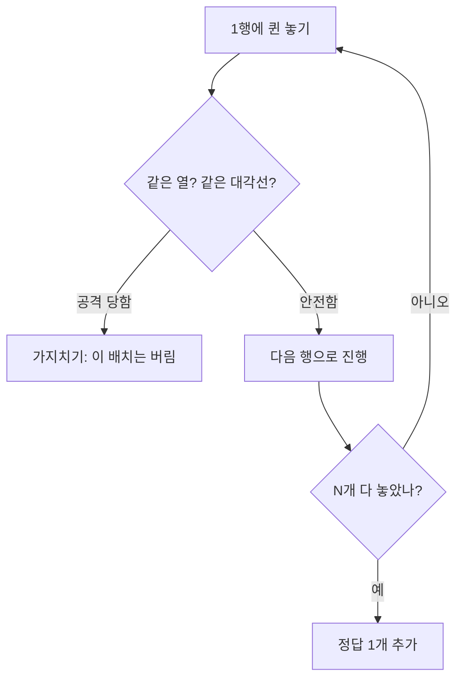

# 백트래킹 - 가다가 막히면 되돌아간다

## 정의

백트래킹은 **한 걸음씩 나아가다, 더 이상 답이 될 수 없으면 바로 뒤로 돌아** 다른 길을 시도한다.
브루트포스가 모든 길을 끝까지 가 보는 것이라면, 백트래킹은 **막힌 길을 일찍 끊는다.** 그래서 가지치기(pruning)라고도 한다.

> 비유: 미로 찾기. 갈림길마다 한 방향으로 들어가 보고, 막다른 길이 나오면 왔던 길로 돌아와 다른 갈림길로 간다.

---

## 1. 구조: 재귀 + 되돌리기

핵심은 3단계다.



코드 뼈대:

```cpp
void dfs(int 단계) {
    if (막힌_상태) return;          // 가지치기
    if (완성됐으면) { 기록; return; }

    for (다음_선택 : 후보들) {
        선택.push(다음_선택);       // 가 본다
        dfs(단계 + 1);              // 더 들어간다
        선택.pop();                 // 되돌아온다 (백트래킹)
    }
}
```

---

## 2. 예제: 1~8 중 3개 고르기 (조합)

순서는 상관없고 중복은 안 된다. 예: 1 2 3, 1 2 4, ...



`start`를 쓰는 이유: 이미 고른 수보다 작은 수는 다시 안 본다. 그래야 중복 없이 조합이 된다.

```cpp
#include <bits/stdc++.h>
using namespace std;

int n = 8, k = 3;
vector<int> cur; // 현재 고른 수

void backtrack(int start) {
    if ((int)cur.size() == k) { // 3개를 다 고르면 출력
        for (int x : cur) cout << x << ' ';
        cout << '\n';
        return;
    }
    for (int i = start; i <= n; i++) {
        cur.push_back(i);   // i를 고른다
        backtrack(i + 1);   // 다음은 i보다 큰 수만 고른다
        cur.pop_back();     // 되돌리기 (백트래킹)
    }
}

int main() {
    backtrack(1);
}
```

출력 일부: `1 2 3` ... `6 7 8` (총 56개)

### 가지치기로 빨라지는 예: N-Queen

N×N 체스판에 퀸 N개를 서로 공격 못 하게 놓는다.



같은 열이나 대각선에 퀸이 있으면 그 갈래는 더 볼 필요 없다. 이 한 줄로 탐색량이 1/10 이하로 준다.

---

## 3. 조합 vs 순열: 한 줄 차이

| 구분 | 코드 차이 | 예 (1,2,3 중 2개) |
|---|---|---|
| 조합 (순서 무시) | `backtrack(i+1)` | 1 2, 1 3, 2 3 |
| 순열 (순서 따짐) | `방문한 수는 건너뛰고 모두 시도` | 1 2, 1 3, 2 1, 2 3, 3 1, 3 2 |

순열 코드 (방문 배열 사용):

```cpp
vector<int> cur;
bool used[9] = {false};

void perm(int depth) {
    if (depth == k) { /* 출력 */ return; }
    for (int i = 1; i <= n; i++) {
        if (used[i]) continue; // 이미 쓴 수는 건너뛰기
        used[i] = true;
        cur.push_back(i);
        perm(depth + 1);
        cur.pop_back();
        used[i] = false; // 되돌리기
    }
}
```

---

## 4. 직접 손으로 풀어 보기

**문제 1.** 1~4 중 2개를 고르는 조합을 백트래킹 트리로 그려라.

<details><summary>풀이</summary>
시작 → 1 선택 → (2,3,4) 중 하나 → 1 2, 1 3, 1 4
시작 → 2 선택 → (3,4) → 2 3, 2 4
시작 → 3 선택 → (4) → 3 4. 총 6개.
</details>

**문제 2.** 순열을 구하는데 `used` 배열을 안 쓰면 무슨 일이 생기나?

<details><summary>풀이</summary>
1 1 같은 중복이 생기고, 같은 수가 여러 번 나온다. 순열은 "이미 쓴 수는 또 쓰지 않는다"가 필수다.
</details>

---

## 5. KOI에서는 이렇게 나온다

- "N개 중 K개 고르기", "N-Queen", "스도쿠", "조합의 합"은 백트래킹 대표 유형이다.
- n ≤ 20~30인데 브루트포스 2ⁿ이 너무 크면, 백트래킹으로 가지치기가 되는 문제인지 본다.
- 가지치기 조건을 잘못 세우면 답을 놓친다. "이래도 답이 될 수 있는가?"를 정확히 판단해야 한다.
- KOI 중등부는 조합·순열 생성 + 가지치기 한 문제씩은 거의 매년 나온다.
