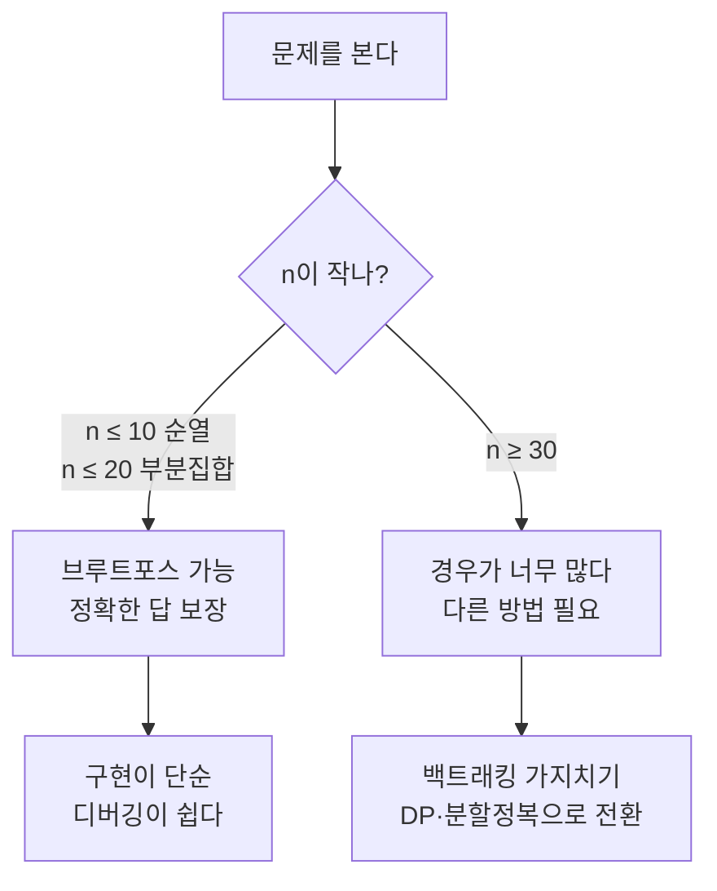
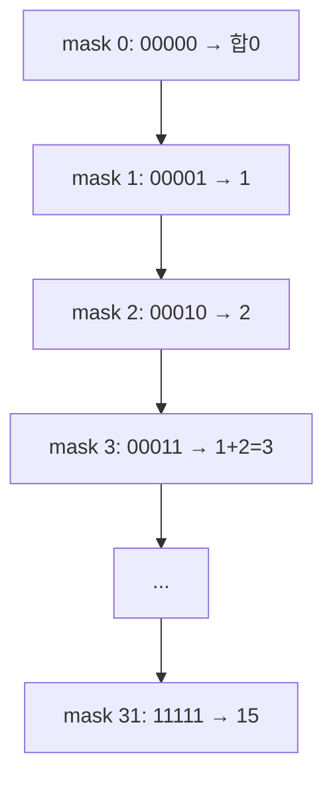

# 브루트포스 - 모든 경우를 다 해 본다

## 정의

브루트포스(Brute Force)는 **가능한 경우를 빠짐없이 전부 시도**해서 답을 찾는다.
영어로 "무식하게 힘으로 밀어붙인다"는 뜻이다.

> 비유: 자물쇠 번호가 000~999 중 하나다. 000부터 999까지 전부 돌려 보면 반드시 열린다. 가장 단순하지만 가장 확실한 방법이다.

---

## 1. 언제 쓰고, 언제 안 쓰나



| 장점 | 단점 |
|---|---|
| 구현이 가장 쉽다 | 경우의 수가 폭증한다 |
| 답이 정확하다 (빠짐없으니) | n이 조금만 커져도 시간초과 |
| 다른 알고리즘의 정답 확인용으로 좋다 | KOI 큰 n에서는 그대로 쓰면 0점 |

---

## 2. 경우의 수 감각

- 동전 10개로 만들 수 있는 부분집합: 2¹⁰ = 1,024
- 동전 20개: 2²⁰ = 1,048,576 (약 100만. 1초 안에 가능)
- 동전 30개: 2³⁰ = 10억 (1초 초과)
- 줄 세우기 10명: 10! = 3,628,800 (가능)
- 줄 세우기 15명: 15! = 1.3조 (불가능)

> KOI는 n 제한으로 브루트포스가 되는지 바로 알려 준다. 제한을 먼저 본다.

---

## 3. 예제: 곱이 100이 되는 두 수 찾기

1~100에서 두 수 i, j의 곱이 100인 경우를 모두 찾는다.

```mermaid
flowchart TD
    S[시작 i=1] --> L1[i=1..100 반복]
    L1 --> L2[j=1..100 반복]
    L2 --> C{i*j == 100?}
    C -->|예| P[(i,j) 기록]
    C -->|아니오| N[다음 j]
    P --> N
    N --> L1
```

```cpp
#include <bits/stdc++.h>
using namespace std;

int main() {
    int target = 100;
    // i, j를 1부터 100까지 전부 시도
    for (int i = 1; i <= 100; i++) {
        for (int j = 1; j <= 100; j++) {
            if (i * j == target) {
                cout << "(" << i << ", " << j << ")\n";
            }
        }
    }
    return 0;
}
```

출력:
```
(1, 100) (2, 50) (4, 25) (5, 20) (10, 10) (20, 5) (25, 4) (50, 2) (100, 1)
```

시간복잡도: 100 × 100 = O(n²). n=100이라 충분히 빠르다.

> 더 빠르게? i만 돌고 `target % i == 0`이면 `j = target / i`로 바로 구하면 O(n)에 끝난다. 브루트포스를 이해한 뒤에는 이렇게 줄이는 연습을 한다.

### KOI형 예제: 부분집합 합

"숫자 n개 중 합이 S가 되는 경우가 있는가?" (n ≤ 20)

```cpp
#include <bits/stdc++.h>
using namespace std;

int main() {
    int n = 5, S = 7;
    vector<int> a = {1, 2, 3, 4, 5};
    bool found = false;

    // 0부터 (1<<n)-1까지가 모든 부분집합 (비트마스크)
    for (int mask = 0; mask < (1 << n); mask++) {
        int sum = 0;
        for (int i = 0; i < n; i++) {
            if (mask & (1 << i)) sum += a[i]; // i번째 원소를 포함
        }
        if (sum == S) found = true;
    }
    cout << (found ? "YES" : "NO") << '\n';
}
```



n=20이면 100만 번 반복. 충분히 가능하다.

---

## 4. 직접 손으로 풀어 보기

**문제 1.** 1~5에서 두 수의 합이 6인 경우를 브루트포스로 모두 찾으면?

<details><summary>풀이</summary>
(1,5) (2,4) (3,3) (4,2) (5,1). 이중 반복문으로 i+j==6을 검사하면 된다.
</details>

**문제 2.** n=30, 부분집합을 전부 보는 브루트포스를 쓰면?

<details><summary>풀이</summary>
2³⁰ = 10억. 1초 안에 못 끝난다. DP나 다른 방법으로 바꿔야 한다.
</details>

---

## 5. KOI에서는 이렇게 나온다

- n ≤ 20이면 부분집합 브루트포스를 먼저 의심한다.
- n ≤ 8이면 순열 브루트포스(`next_permutation`)를 의심한다.
- 브루트포스로 통과되는지 n 제한으로 먼저 판단하고, 안 되면 백트래킹·DP로 넘어간다. 브루트포스는 "기준점"이다.
