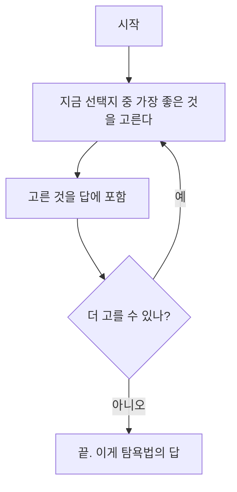
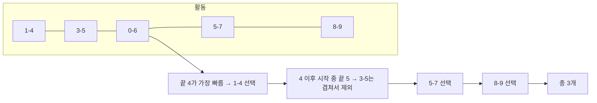
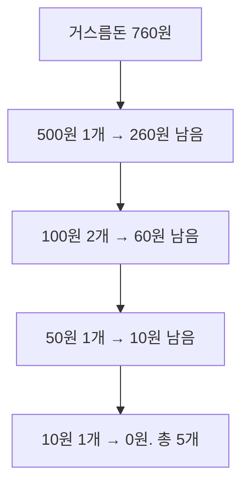
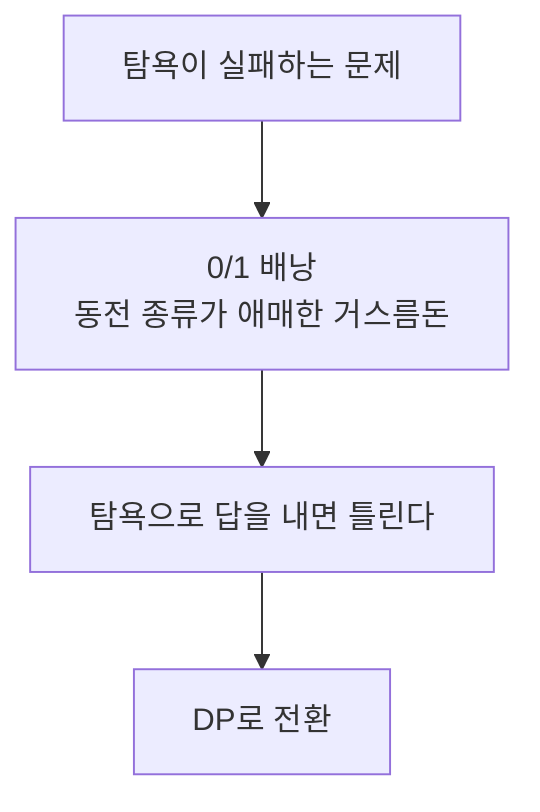

# 탐욕법 - 지금 가장 좋아 보이는 것을 고른다

## 정의

탐욕법(Greedy)은 **매 순간 가장 좋아 보이는 선택**을 한다. 앞뒤 재지 않고 지금 최선이면 고른다.
그 선택들이 모여 전체 최선이 되면 성공, 아니면 실패다.

> 비유: 1,000원짜리 간식 뽑기. 가성비가 가장 좋은 것부터 담는다. "지금 가장 이득인 것"만 보면 된다면 탐욕법이 답이다.



---

## 1. 탐욕법이 통하는 조건

1. **탐욕적 선택이 전체 최선으로 이어진다**
2. **앞의 선택이 뒤의 선택을 망치지 않는다** (또는 그 피해가 최선 안에 포함된다)

이 조건이 안 맞는데 탐욕법을 쓰면 틀린 답이 나온다. KOI는 이 차이를 노린다.

---

## 2. 성공하는 대표 예제 3가지

### 예제 1: 활동 선택 - 가장 빨리 끝나는 것부터

회의실 하나에 여러 회의를 넣을 때, 가장 많이 넣는 방법.

**규칙: 끝나는 시간이 가장 빠른 회의부터 고른다.**



> 잘못된 탐욕: "시작이 빠른 것부터" 고르면 0-6을 먼저 골라 2개밖에 못 고른다. "끝이 빠른 것"이 핵심이다.

```cpp
#include <bits/stdc++.h>
using namespace std;

struct Act { int s, e; };

int main() {
    vector<Act> a = {{1,4},{3,5},{0,6},{5,7},{8,9}};
    sort(a.begin(), a.end(), [](auto &p, auto &q){
        return p.e < q.e; // 끝나는 시간이 빠른 순
    });
    int cnt = 0, lastEnd = -1;
    for (auto &x : a) {
        if (x.s >= lastEnd) { // 겹치지 않으면 선택
            cnt++;
            lastEnd = x.e;
        }
    }
    cout << cnt << '\n'; // 3
}
```

### 예제 2: 거스름돈 - 큰 동전부터

동전이 500, 100, 50, 10원일 때 가장 적게 주는 방법.



큰 동전부터 고르면 최소 개수다. (단, 동전이 400, 300, 250원처럼 애매하면 이 탐욕은 실패한다.)

### 예제 3: 부분 배낭 - 가성비 순

무게 제한 50, 물건을 쪼갤 수 있을 때.

**규칙: 1kg당 가치가 높은 것부터 담는다.**

| 물건 | 가치 | 무게 | 가성비 |
|---|---|---|---|
| A | 60 | 10 | 6 |
| B | 100 | 20 | 5 |
| C | 120 | 30 | 4 |

50kg → A 10kg + B 20kg + C 20kg(쪼개서) = 가치 60+100+80=240 (최적)

쪼갤 수 없으면(0/1 배낭) 이 탐욕은 실패한다. KOI는 "쪼갤 수 있는가?"를 꼭 확인시킨다.

```cpp
struct Item { int value, weight; double ratio; };

int main() {
    vector<Item> items = {{60,10,6},{100,20,5},{120,30,4}};
    sort(items.begin(), items.end(), [](auto &a, auto &b){
        return a.ratio > b.ratio;
    });
    int W = 50, cur = 0;
    double total = 0;
    for (auto &it : items) {
        if (cur + it.weight <= W) { cur += it.weight; total += it.value; }
        else { total += it.value * double(W - cur) / it.weight; break; }
    }
    cout << total << '\n';
}
```

---

## 3. 탐욕법이 실패하는 예

**0/1 배낭** (쪼갤 수 없음), 무게 50.

- 탐욕(가성비 순): A+B = 30kg, 가치 160. 남은 20kg에 C는 30kg이라 못 넣음 → 160
- 최적: B+C = 50kg, 가치 220 → 탐욕보다 크다.

> 결론: 쪼갤 수 없으면 탐욕으로 풀지 않는다. DP로 푼다.



---

## 4. 직접 손으로 풀어 보기

**문제 1.** 활동 (1,3) (2,4) (3,5). 끝나는 시간 순 탐욕으로 몇 개 고르나?

<details><summary>풀이</summary>
끝 3 → 1,3 선택, 다음 2,4는 겹쳐서 제외, 3,5 선택 → 총 2개. 이게 최적이다.
</details>

**문제 2.** 동전이 500, 400, 300원, 거스름돈 800원. 큰 동전부터 탐욕이면?

<details><summary>풀이</summary>
500+300=800 (2개)가 답인데 탐욕은 500+300=800으로 우연히 맞는다. 600원이면 탐욕은 500+...1개 남음→ 못 만들고, 최적은 300+300=600 (2개)로 탐욕이 실패한다. 동전 종류에 따라 탐욕이 되는지 따져야 한다.
</details>

---

## 5. KOI에서는 이렇게 나온다

- "가장 많이", "가장 적게"가 나오면 탐욕을 의심한다.
- 하지만 바로 탐욕으로 쓰지 않는다. **"지금 최선이 전체 최선인가?"**를 반례 한 개로 검증한다.
- 활동 선택, 거스름돈(일반 동전), 부분 배낭은 KOI 단골 탐욕 유형이다.
- 0/1 배낭처럼 보이면 탐욕이 아니라 DP다. 둘을 구분하는 것이 점수를 가른다.
