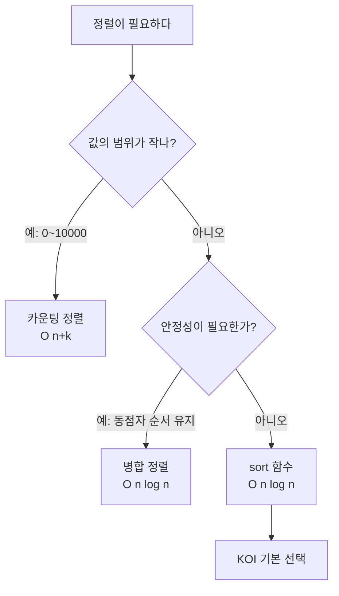
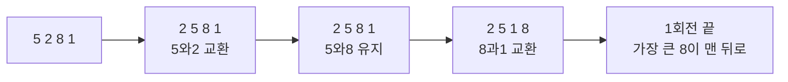
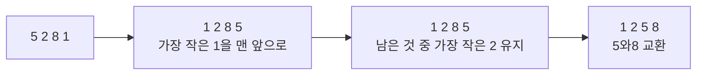
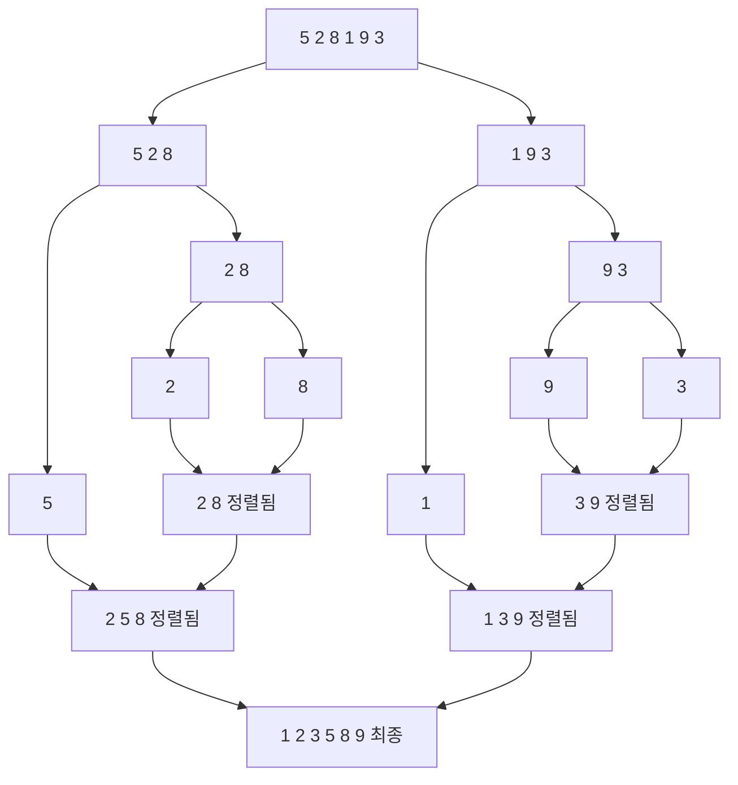

# 정렬 - 순서대로 세우기

## 왜 정렬부터 배울까?

KOI 문제의 절반은 "정렬하고 나서 생각한다"로 시작한다.
정렬이 돼 있으면 이분탐색, 투포인터, 그리디가 모두 쉬워진다.

> 비유: 키 순서대로 줄 세우기. 키 순으로 서 있으면 "가장 작은 사람"을 찾는 데 1초면 된다. 섞여 있으면 30명을 다 봐야 한다.

---

## 1. 정렬을 고를 때 보는 3가지

1. **시간** - 얼마나 빠른가 (O 표시)
2. **공간** - 메모리를 얼마나 더 쓰는가
3. **안정성** - 같은 값의 순서가 유지되는가 (동점자 처리에서 중요)

| 정렬 | 평균 시간 | 공간 | 안정 | 언제 쓰나 |
|---|---|---|---|---|
| 버블 | O(n²) | O(1) | 유지 | n ≤ 1,000, 교육용 |
| 선택 | O(n²) | O(1) | 깨짐 | n ≤ 1,000 |
| 삽입 | O(n²) 평균, 거의 정렬이면 O(n) | O(1) | 유지 | 거의 정렬된 데이터 |
| 퀵 | O(n log n) 평균, 최악 O(n²) | O(log n) | 깨짐 | 일반적으론 빠름 |
| 병합 | O(n log n) | O(n) | 유지 | 안정성이 필요할 때 |
| 카운팅 | O(n+k) | O(k) | 유지 | 값의 범위 k가 작을 때 (예: 0~10,000) |
| 기수 | O(d·(n+k)) | O(n+k) | 유지 | 자릿수 d가 작을 때 |

> KOI 실전: 직접 정렬을 구현하지 않는다. `sort()`를 쓴다. C++ `sort()`는 O(n log n)이며 충분히 빠르다.



---

## 2. 동작을 그림으로 보기

### 버블 정렬 - 옆 사람과 비교해 큰 것을 뒤로 민다



코드:

```cpp
void bubbleSort(vector<int>& a) {
    int n = a.size();
    for (int i = 0; i < n - 1; i++) {
        for (int j = 0; j < n - i - 1; j++) {
            if (a[j] > a[j + 1]) swap(a[j], a[j + 1]); // 옆과 비교해 크면 교환
        }
    }
}
```

### 선택 정렬 - 남은 것 중 가장 작은 것을 앞으로



### 삽입 정렬 - 한 장씩 꺼내 알맞은 자리에 꽂는다

```mermaid
flowchart LR
    I1[손패: 5 | 덱: 2 8 1] --> I2[2 5 | 8 1\n2를 5 앞에 삽입]
    I2 --> I3[2 5 8 | 1\n8은 제자리]
    I3 --> I4[1 2 5 8\n1을 맨 앞에 삽입]
```

```cpp
void insertionSort(vector<int>& a) {
    for (int i = 1; i < a.size(); i++) {
        int key = a[i], j = i - 1;
        while (j >= 0 && a[j] > key) { // key보다 큰 것은 한 칸 뒤로
            a[j + 1] = a[j];
            j--;
        }
        a[j + 1] = key;
    }
}
```

### 병합 정렬 - 반으로 나누고, 정렬된 것끼리 합친다 (분할정복)



### 퀵 정렬 - 기준(pivot)을 잡고 작은 것은 왼쪽, 큰 것은 오른쪽

```mermaid
flowchart TD
    Q0[5 2 8 1 9 3\npivot=3] --> Q1[2 1 |3| 8 9 5\n3보다 작으면 왼쪽]
    Q1 --> Q2[왼쪽 다시 정렬]
    Q1 --> Q3[오른쪽 다시 정렬]
    Q2 --> Q4[1 2]
    Q3 --> Q5[5 8 9]
    Q4 & Q5 --> Q6[1 2 3 5 8 9]
```

> KOI에서는 퀵/병합을 직접 구현할 일이 거의 없다. 원리를 그림으로 이해하고 `sort()`를 쓰면 된다.

---

## 3. KOI에서 쓰는 정렬은 이것 하나

```cpp
#include <bits/stdc++.h>
using namespace std;

int main() {
    vector<int> a = {5, 2, 8, 1, 9, 3};
    sort(a.begin(), a.end()); // 오름차순 O(n log n)

    for (int x : a) cout << x << ' '; // 1 2 3 5 8 9
    cout << '\n';

    sort(a.begin(), a.end(), greater<int>()); // 내림차순
    for (int x : a) cout << x << ' '; // 9 8 5 3 2 1
}
```

값의 범위가 작을 때만 카운팅 정렬을 고려한다:

```cpp
// 값은 0~10000, n은 1,000,000일 때 O(n+k)로 더 빠르다
void countingSort(vector<int>& a, int maxVal) {
    vector<int> cnt(maxVal + 1, 0);
    for (int x : a) cnt[x]++;
    int idx = 0;
    for (int v = 0; v <= maxVal; v++)
        while (cnt[v]--) a[idx++] = v;
}
```

---

## 4. 직접 손으로 풀어 보기

**문제 1.** `[4, 1, 3, 2]`를 버블 정렬로 1회전 하면?

<details><summary>풀이</summary>
4>1 교환 → 1 4 3 2 → 4>3 교환 → 1 3 4 2 → 4>2 교환 → 1 3 2 4. 가장 큰 4가 맨 뒤로 간다.
</details>

**문제 2.** n=200,000, 값은 0~1,000,000. 어떤 정렬을 쓰나?

<details><summary>풀이</summary>
값의 범위가 넓어 카운팅은 메모리 1,000,001 필요로 비효율. 그냥 `sort()` O(n log n)이 정답.
</details>

---

## 5. KOI에서는 이렇게 나온다

- "점수 순으로 정렬한 뒤 앞에서 k명을 뽑아라" → 정렬이 전제
- "두 배열의 합이 가장 작게" → 둘 다 정렬 후 비교
- 정렬 없이 풀면 O(n²)인 문제가 정렬 후 O(n log n)에 풀린다. KOI는 이 차이를 노리고 낸다.
