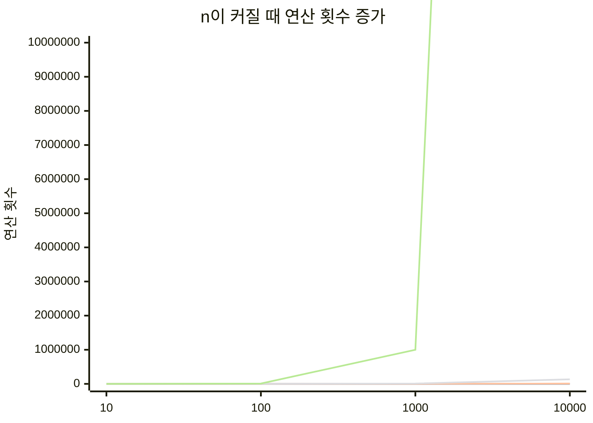
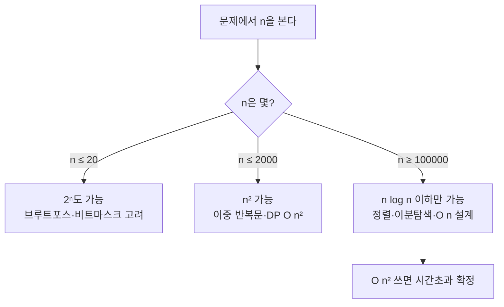

# 시간복잡도 - 알고리즘이 얼마나 빠른지 재는 자

## 왜 배워야 할까?

같은 문제를 풀어도 방법에 따라 걸리는 시간이 다르다.
KOI는 제한 시간이 1~2초다. 느린 방법은 시간 초과로 0점이다.
시간복잡도는 "입력 n이 커질 때 연산 횟수가 어떻게 늘어나는가"를 보는 자다.

> 비유: 30명 출석 부르기
> - 선생님이 맨 앞자리만 본다 → 1번 보면 끝. O(1)
> - 30명 이름을 차례로 부른다 → 30번. O(n)
> - 30명끼리 서로 인사한다 → 30×30=900번. O(n²)

---

## 1. Big-O는 최악을 본다

알고리즘은 빠를 때도, 느릴 때도 있다. 채점은 가장 느린 경우로 한다.
그래서 Big-O는 **최악의 경우 연산 횟수의 증가 형태**만 남긴다.

```
O(1)      : n이 커져도 1번이면 끝
O(log n)  : n이 2배가 돼도 1번만 더 하면 된다 (반으로 나누기)
O(n)      : n만큼 비례해서 늘어난다
O(n log n): n번 하는데 한 번 할 때마다 log n만큼 더 든다 (정렬)
O(n²)     : 이중 반복문. n=1000이면 100만 번
O(2ⁿ)     : 모든 부분집합을 다 본다. n=30이면 10억 번
O(n!)     : 모든 순서를 다 본다. n=10이면 360만 번
```

```mermaid
flowchart LR
    A[입력 n] --> B{어떤 알고리즘?}
    B -->|한 번만 접근| C[O1\n예: arr[0]]
    B -->|반씩 나누기| D[O log n\n예: 이진탐색]
    B -->|한 번 훑기| E[O n\n예: 전체 합 구하기]
    B -->|훑고 나누기| F[O n log n\n예: 병합정렬]
    B -->|이중 훑기| G[O n²\n예: 버블정렬]
    B -->|모든 경우| H[O 2ⁿ / n!\n예: 모든 부분집합]
```

### 증가 속도 그림으로 보기



> 읽는 법: n=1000에서 O(n²)은 100만, O(n log n)은 1만보다 작다. KOI에서 n=100,000이면 O(n²)는 절대 통과 못 한다.

---

## 2. 자주 나오는 복잡도 판별법

| 코드 형태 | 복잡도 | 판단 이유 |
|---|---|---|
| `arr[0]` , `a+b` | O(1) | n과 상관없이 항상 1번 |
| `for(i=0;i<n;i++)` 한 개 | O(n) | n번 돈다 |
| `for 안의 for` | O(n²) | n × n |
| `while(n>1) n/=2` | O(log n) | 반씩 줄인다 |
| `sort()` | O(n log n) | C++ 정렬은 이 속도 |
| `부분집합 전부 생성` | O(2ⁿ) | 각 원소마다 넣는다/안 넣는다 2가지 |

> 핵심 규칙: **가장 크게 늘어나는 항만 남긴다.**
> `n² + n + 1` → O(n²). n이 10만이면 `n`은 `n²`에 비해 의미 없다.

### Ω, Θ는 언제 쓰나?

- O: 최악. "아무리 느려도 이보다는 빠르다" - 채점 기준
- Ω: 최선. "아무리 빨라도 이보다는 느리다"
- Θ: 최선과 최악이 같을 때. "정확히 이 정도"

KOI에서는 **O만 제대로 알면 된다.**

---

## 3. KOI 시간 제한으로 거꾸로 계산하기

1초에 C++는 약 1억 번 연산한다.

| n의 크기 | 통과 가능한 복잡도 | KOI에서 자주 보이는 n |
|---|---|---|
| n ≤ 10 | O(n!) 가능 | 순열 전부 보기 |
| n ≤ 20 | O(2ⁿ) 가능 | 부분집합 |
| n ≤ 1,000 | O(n²) 가능 | 이중 반복문 |
| n ≤ 100,000 | O(n log n) 까지 | 정렬 필요 |
| n ≤ 1,000,000 | O(n) 까지 | 한 번 훑기 |



> 예: n=200,000인데 이중 반복문을 쓰면 400억 번. 1초 안에 절대 못 끝난다.
> → 정렬 후 한 번 훑는 방법으로 바꿔야 한다.

---

## 4. 직접 손으로 계산해 보기

**문제 1.** 다음 코드의 시간복잡도는?

```cpp
int sum = 0;
for (int i = 0; i < n; i++) {
    for (int j = 0; j < n; j++) {
        sum += i + j;
    }
}
```

<details><summary>풀이 보기</summary>
바깥 반복 n번, 안쪽도 n번 → n × n = O(n²)
</details>

**문제 2.** n=1,000,000, 1초 제한일 때 O(n²) 알고리즘을 쓰면?

<details><summary>풀이 보기</summary>
1조 번 연산 필요 → 1억 번/초 기준 10,000초 → 시간초과. O(n)이나 O(n log n)으로 바꿔야 한다.
</details>

---

## 5. KOI에서는 이렇게 나온다

- 입력 제한을 먼저 본다. `n ≤ 500,000` 이라고 쓰여 있으면 O(n²) 풀이는 처음부터 제외한다.
- "정렬"이 필요해 보이면 O(n log n)을 예산에 넣는다.
- 시간복잡도를 모르면, 맞게 풀어도 시간초과로 0점이 된다.

> 다음 장인 `정렬`에서 O(n log n)이 왜 나오는지 그림으로 확인한다.
