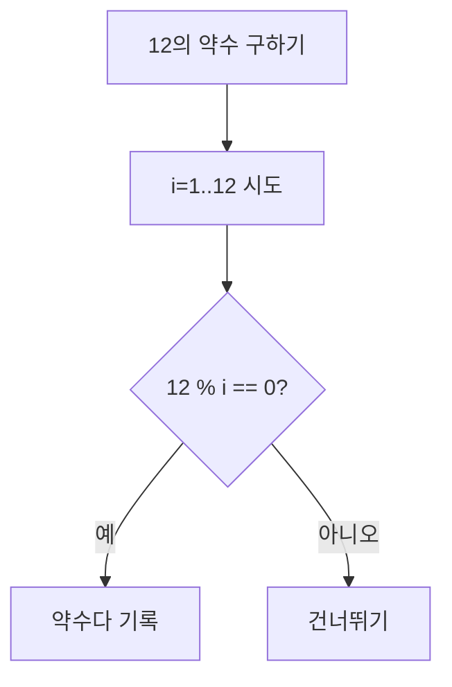
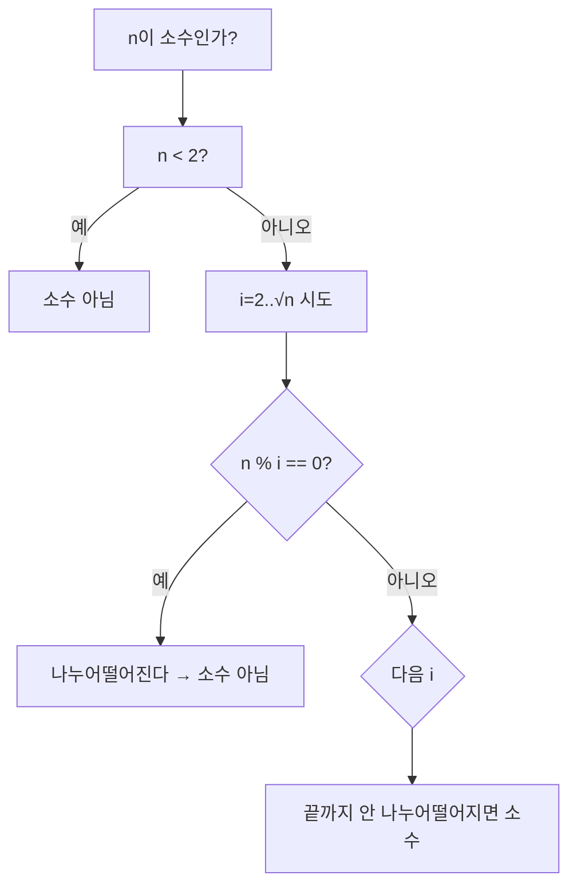
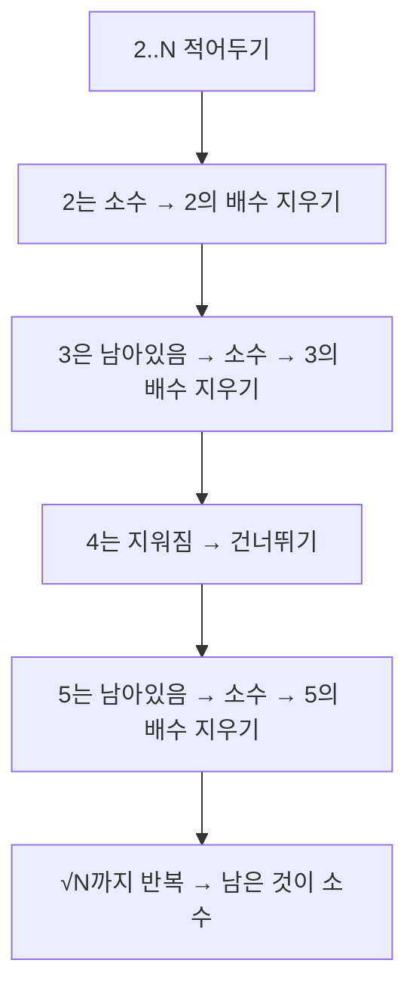

# 약수·배수·소수 - KOI 수학 기본기

## 왜 먼저 해야 할까?

KOI는 수학을 코드로 옮기는 문제가 매년 나온다. 약수·배수·소수는 그 출발점이다.
세 개념을 코드로 바로 쓸 수 있어야 한다.

> 약속: `a % b == 0`이면 "a는 b로 나누어떨어진다"고 읽는다.

---

## 1. 약수 - 나누어떨어지는 수

`n`을 나누어떨어지게 하는 수.

```
12의 약수: 1, 2, 3, 4, 6, 12
```



```cpp
#include <bits/stdc++.h>
using namespace std;

void findDivisors(int n) {
    cout << n << "의 약수: ";
    for (int i = 1; i <= n; i++) {
        if (n % i == 0) cout << i << ' ';
    }
    cout << '\n';
}
int main() { findDivisors(12); } // 1 2 3 4 6 12
```

### 더 빠르게: √n까지만 본다

약수는 짝을 이룬다. 12 = 1×12 = 2×6 = 3×4. √12≈3.4까지만 보면 짝을 찾을 수 있다.

```cpp
void findDivisorsFast(int n) {
    vector<int> small, large;
    for (int i = 1; i * i <= n; i++) {
        if (n % i == 0) {
            small.push_back(i);
            if (i * i != n) large.push_back(n / i);
        }
    }
    for (int x : small) cout << x << ' ';
    for (int i = large.size()-1; i >= 0; i--) cout << large[i] << ' ';
    cout << '\n';
}
```

시간: O(n) → O(√n). n=1,000,000이면 100만 번 → 1천 번으로 준다.

---

## 2. 배수 - 몇 배로 불린 수

`n`의 배수는 `n×1, n×2, n×3, ...`

```
5의 배수 10개: 5 10 15 20 25 30 35 40 45 50
```

```cpp
void findMultiples(int n, int cnt) {
    cout << n << "의 배수 " << cnt << "개: ";
    for (int i = 1; i <= cnt; i++) cout << n * i << ' ';
    cout << '\n';
}
```

> KOI 포인트: "3과 5의 공배수"는 15의 배수다. 배수는 최소공배수(LCM)로 묶어 생각한다.

---

## 3. 소수 - 약수가 1과 자기 자신뿐인 수

```
소수: 2, 3, 5, 7, 11, 13, 17, 19, ...
1은 소수가 아니다. 2는 유일한 짝수 소수다.
```



왜 √n까지만 보면 되나? 나누어떨어지는 수가 있으면 한쪽은 반드시 √n 이하에 있기 때문이다.

```cpp
#include <cmath>
bool isPrime(int n) {
    if (n < 2) return false;
    for (int i = 2; i * i <= n; i++) { // sqrt 대신 i*i로 비교
        if (n % i == 0) return false;
    }
    return true;
}
int main() {
    cout << (isPrime(17) ? "소수" : "소수 아님") << '\n';
}
```

### 100 이하 소수 출력

```cpp
int main() {
    cout << "100 이하 소수: ";
    for (int i = 2; i <= 100; i++) if (isPrime(i)) cout << i << ' ';
}
```

```
2 3 5 7 11 13 17 19 23 29 31 37 41 43 47 53 59 61 67 71 73 79 83 89 97
```

### 많은 소수를 한 번에: 에라토스테네스 체

1~N까지 소수를 모두 찾을 때 가장 빠르다. O(N log log N)



```cpp
vector<int> sieve(int N) {
    vector<bool> isPrime(N + 1, true);
    isPrime[0] = isPrime[1] = false;
    for (int i = 2; i * i <= N; i++) {
        if (!isPrime[i]) continue;
        for (int j = i * i; j <= N; j += i) isPrime[j] = false;
    }
    vector<int> primes;
    for (int i = 2; i <= N; i++) if (isPrime[i]) primes.push_back(i);
    return primes;
}
```

---

## 4. 직접 손으로 풀어 보기

**문제 1.** 60의 약수를 √n 방법으로 구할 때 i는 어디까지 보면 되나?

<details><summary>풀이</summary>
√60≈7.7 → 7까지. 1,2,3,4,5,6,7 중 나누어떨어지는 것(1,2,3,4,5,6)과 짝(60,30,20,15,12,10)을 모으면 전체 약수다.
</details>

**문제 2.** 1~1,000,000 소수를 1개씩 `isPrime`으로 판별 vs 체. 어느 것이 빠른가?

<details><summary>풀이</summary>
개별 판별은 100만 × √n ≈ 10억 번 연산. 체는 약 500만 번. 체가 압도적으로 빠르다.
</details>

---

## 5. KOI에서는 이렇게 나온다

- "소수 판별" n ≤ 1,000,000, 여러 번 물어보면 → 체를 먼저 만들어 둔다.
- 최대공약수(GCD)·최소공배수(LCM)는 약수·배수 개념과 세트다. `gcd`는 `std::gcd`, `lcm`은 `a / gcd(a,b) * b`로 구한다.
- 약수 개수, 소인수 분해 문제는 √n까지만 보는 습관이 시간을 가른다.
